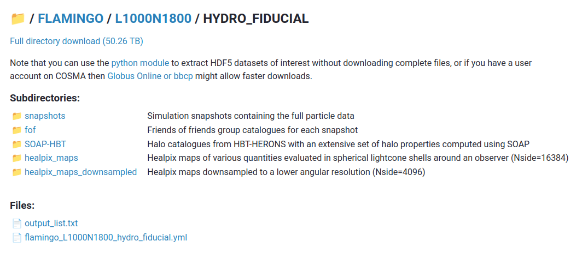
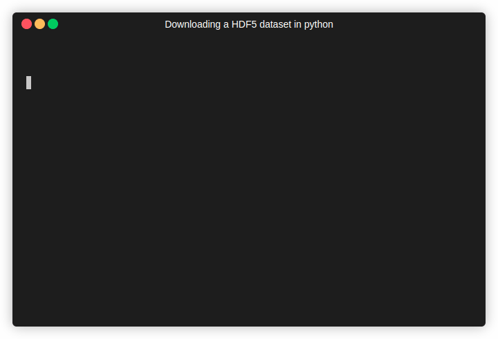

Service Overview
================

This service provides web based remote access to the `FLAMINGO
simulations <https://flamingo.strw.leidenuniv.nl/>`__ as described in
`Schaye et al (2023) <https://ui.adsabs.harvard.edu/abs/2023MNRAS.tmp.2384S>`__
and `Kugel et al (2023) <https://ui.adsabs.harvard.edu/abs/2023arXiv230605492K>`__.

FLAMINGO simulation data products
---------------------------------

The following data products are available:

  * Snapshots of the full distribution of particles (dark matter, gas,
    stars, black holes and neutrinos) at a series of output times
    between redshift z=15 and the present day
  * Halo catalogues and merger trees generated using the HBTplus (or
    HERONS?)  halo finder with a wide range of halo properties
    computed using the `SOAP post-processing tool
    <https://joss.theoj.org/papers/10.21105/joss.08252>`__
  * Full sky lightcone particle outputs, where each simulation
    particle is output as it crosses the past lightcone of an observer
    placed somewhere in the simulation volume
  * Full sky `HEALPix maps <https://healpix.sourceforge.io/>`__ of
    various quantities evaluated in spherical shells around each
    lightcone observer. These include the total mass in gas, stars and
    dark matter, the X-ray luminosity of the gas in several bands, and
    measurements of the thermal and kinetic Sunyaev–Zeldovich effects.

See the links in the sidebar for full documentation.

Downloading simulation data
---------------------------

All outputs are stored in the form of HDF5 files. Complete files and
directories (such as a full simulation snapshot or a halo catalogue)
can be downloaded directly for local analysis. We provide a `web-based
file browser <viewer.html?path=FLAMINGO>`__ which can be used to
locate files of interest and view their contents.

Accessing subsets of the data
-----------------------------

We also provide a mechanism to request parts of HDF5 files without
downloading the whole file. This allows more granular access: it is
possible, for example, to download just the star particles from some
specified region in a simulation snapshot or download only a few
properties of interest from a halo catalogue.

We provide adapted versions of the pynbody and swiftsimio python
modules which can transparently make use of this service, and a more
generic hdfstream module which allows downloads of arbitrary HDF5 data
using a similar API to h5py.

