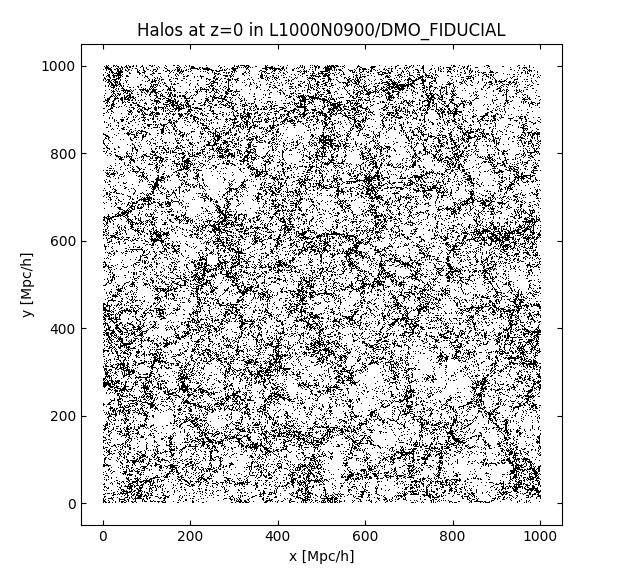

Python examples
===============

Plotting SOAP halo positions
----------------------------

Here we open the z=0 SOAP halo catalogue for one of the FLAMINGO
simulations, download the halo positions, and make a plot.

First, we connect to the server and open the FLAMINGO root directory::

    import hdfstream
    root = hdfstream.open("cosma","/FLAMINGO")

This returns a RemoteDirectory object which can be indexed to access
subdirectories and files.

Opening the file
^^^^^^^^^^^^^^^^

We subscript the root directory with the path to the file we want to
read.  In this case the we're going to read the halo positions from
a SOAP halo catalogue. The correct file path can be determined by browsing
the file hierarchy in the
`file browser <viewer.html?path=/FLAMINGO/L1_m10/L1_m10_DMO/SOAP-HBT>`__.
To open this file in python::

    soap_file = root["L1_m10/L1_m10_DMO/SOAP-HBT/halo_properties_0077.hdf5"]

This returns a RemoteFile object which allows access to HDF5 objects in
the file (it behaves similarly to a read only h5py.File or h5py.Group).

Reading the halo positions
^^^^^^^^^^^^^^^^^^^^^^^^^^

We can see the contents of this particular halo catalogue file in the
`file browser
<viewer.html?path=/FLAMINGO/L1_m10/L1_m10_DMO/SOAP-HBT/halo_properties_0077.hdf5>`__
and the format of SOAP output files is described in the
:doc:`documentation pages <soap>`. The dataset
``BoundSubhalos/CentreOfMass`` contains the centre of mass of the
particles bound to each halo. To read the halo positions from the
file::

    halo_pos = soap_file["BoundSubhalo/CentreOfMass"][...]

This returns the result as a numpy array. We can also view any metadata
attributes on the datasets in order to determine the units. E.g.::

    print(soap_file["BoundSubhalo/CentreOfMass"].attrs)

Plotting the positions
^^^^^^^^^^^^^^^^^^^^^^

We can then make a plot of halos in a slice through the volume using matplotlib::

    import matplotlib.pyplot as plt
    to_plot = halo_pos[:,2] < 50.0 # Plot a 50Mpc/h slice in the x-y plane
    plt.plot(halo_pos[to_plot,0], halo_pos[to_plot,1], "k,", rasterized=True)
    plt.gca().set_aspect("equal")
    plt.xlabel("x [Mpc/h]")
    plt.ylabel("y [Mpc/h]")
    plt.title("Halos at z=0 in L1_m9/L1_m9_DMO")
    plt.show()

