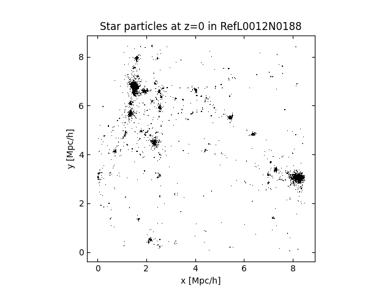

Python examples
===============

Plotting star particles in EAGLE
--------------------------------

Here we download the positions of star particles in one of the EAGLE
simulations and make a dotplot. First, we connect to the server and
open the EAGLE root directory::

    import hdfstream
    root = hdfstream.open("cosma","EAGLE")

This returns a RemoteDirectory object which can be indexed to access
subdirectories and files.

Opening a file
--------------

We index the root directory with the path to the file we want to
read.  In this case the we're going to read the star particles from
a simulation snapshot.  The snapshot is split over multiple
files. The correct file paths can be determined by browsing the file
hierarchy in the
`web interface <viewer.html?path=/EAGLE/Fiducial_models/RefL0012N0188/snapshot_028_z000p000>`__
and you can see the contents of one of the snapshot files
`here <viewer.html?path=/EAGLE/Fiducial_models/RefL0012N0188/snapshot_028_z000p000/snap_028_z000p000.0.hdf5>`__.

To open this file in python::

    snap_file = root["Fiducial_models/RefL0012N0188/snapshot_028_z000p000/snap_028_z000p000.0.hdf5"]

This returns a RemoteFile object which allows access to HDF5 objects in
the file (it behaves similarly to a read only h5py.File or h5py.Group).

Reading a dataset
-----------------

To read a dataset we can index the file as we would if we were using h5py.
To read the star particle positions from one file::

    star_pos = snap_file["PartType4/Coordinates"][...]

This returns the result as a numpy array. We can also view any metadata
attributes on the datasets in order to determine the units. E.g.::

    print(snap_file["PartType4/Coordinates"].attrs)

And we can determine the number of files in the set by reading an attribute
on the Header group::

    nr_files = snap_file["Header"].attrs["NumFilesPerSnapshot"]

Reading the full snapshot
-------------------------

In order to read the positions of all of the star particles in the
snapshot we need to loop over all files in the set and concatenate
the particle position datasets::

    import numpy as np

    # Connect to the server, if we didn't already
    import hdfstream
    root = hdfstream.RemoteDirectory("__SERVER_URL__","EAGLE")

    # Format string to generate the filenames
    filenames="Fiducial_models/RefL0012N0188/snapshot_028_z000p000/snap_028_z000p000.{file_nr}.hdf5"

    # List to contain the positions from each file
    star_pos = []

    # Loop over files and read positions
    nr_files = 1
    file_nr = 0
    while file_nr < nr_files:
        filename = filenames.format(file_nr=file_nr)
        snap_file = root[filename]
        # Find number of files in the set
        if file_nr == 0:
            nr_files = snap_file["Header"].attrs["NumFilesPerSnapshot"]
        # Read positions from this file
        star_pos.append(snap_file["PartType4/Coordinates"][...])
        file_nr += 1

    # Combine results
    star_pos = np.concatenate(star_pos)

Plotting the positions
----------------------

We can then make a plot of stars in a slice through the volume using matplotlib::

    import matplotlib.pyplot as plt
    to_plot = star_pos[:,2] < 10.0 # Plot a 10Mpc/h slice in the x-y plane
    plt.plot(star_pos[to_plot,0], star_pos[to_plot,1], "k,", rasterized=True)
    plt.gca().set_aspect("equal")
    plt.xlabel("x [Mpc/h]")
    plt.ylabel("y [Mpc/h]")
    plt.title("Star particles at z=0 in RefL0012N0188")
    plt.show()

