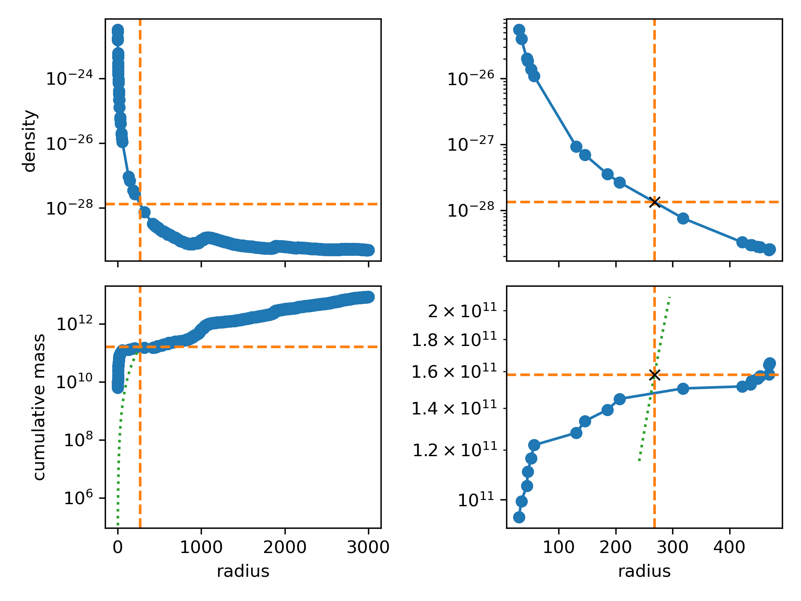
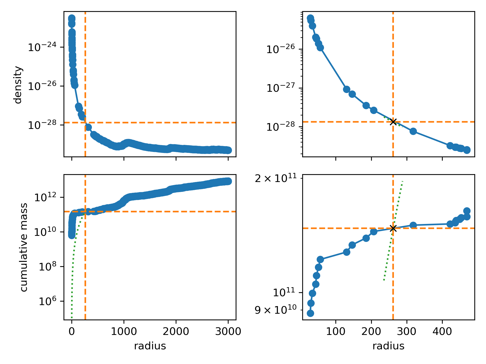

SOAP halo catalogues
====================

SOAP computes different types of properties, depending on how particles
are included (by radius, in projection...). For all types, we use the
halo membership and centre of potential as determined by the input halo
catalogue. This documentation is generated using the SOAP parameter
file, and so the properties listed reflect those present in the current
run of SOAP, rather than all possible properties.

Property types
==============

Subhalo quantities (SH)
^^^^^^^^^^^^^^^^^^^^^^^

are computed for each subhalo identified by the halo finder,
irrespective of whether it is a field halo or a satellite (or even
satellite of satellite and so on). They include all particles that they
halo finder has determined are bound to the subhalo. Subhalo properties
are contained within the group ``BoundSubhalo`` in the output file.

Exclusive sphere quantities (ES)
^^^^^^^^^^^^^^^^^^^^^^^^^^^^^^^^

are similar to subhalo quantities, but they include only the particles
that are bound to the subhalo, and apply an additional radial cut
(aperture). We use eight different aperture radii (10, 30, 50, 100, 300,
500, 1000, 3000 kpc), so that every (sub-)halo has eight of these.
Exclusive sphere properties are contained within a group
``ExclusiveSphere/XXXkpc``, where ``XXX`` is the corresponding aperture
radius.

Inclusive sphere quantities (IS)
^^^^^^^^^^^^^^^^^^^^^^^^^^^^^^^^

use the same physical aperture radii as the exclusive sphere quantities,
but include all particles within the radius, regardless of their
membership status. They are stored within a group
``InclusiveSphere/XXXkpc``.

Exclusive projected quantities (EP)
^^^^^^^^^^^^^^^^^^^^^^^^^^^^^^^^^^^

are similar to exclusive sphere quantities, except that their aperture
filter is applied in projection, and this for independent projections
along the x-, y- and z-axis. Along the projection axis, we do not apply
any radial cut, so that the depth corresponds to all particles bound to
the (sub-)halo. With four projected aperture radii (10, 30, 50, 100
kpc), we then have twelve sets of projected aperture quantities for each
(sub-)halo. Projected aperture quantities are stored in a group named
``ProjectedAperture/XXXkpc/projP``, where ``XXX`` is the corresponding
aperture radius, and ``P`` corresponds to a particular projection
direction (``x``, ``y`` or ``z``).

Spherical overdensity properties (SO)
^^^^^^^^^^^^^^^^^^^^^^^^^^^^^^^^^^^^^

are fundamentally different from the three other types in that their
aperture radius is determined from the density profile and is different
for different halos. They always include all particles within a sphere
around the centre of potential, regardless of halo membership. The
radius is either the radius at which the density reaches a certain
target value (50 crit, 100 crit, 200 crit, 500 crit, 1000 crit, 2500
crit, 200 mean, BN98) or a multiple of such a radius (5xR 500 crit).
Details of the spherical overdensity calculation are given at the end of
this document. Spherical overdensities are only computed for centrals,
i.e. field halos. The inclusive sphere quantities are stored in a group
``SO/XXX``, where ``XXX`` can be either ``XXX_mean`` for density
multiples of the mean density, ``XXX_crit`` for density multiples of the
critical density, ``BN98`` for the overdensity definition of Bryan &
Norman (1998), and ``YxR_XXX_ZZZ`` for multiples of some other radius
(e.g. ``5xR_2500_mean``). The latter can only be computed after the
corresponding density multiple SO radius has been computed. This is
achieved by ordering the calculations.

InputHalos
^^^^^^^^^^

Some properties are directly copied from the original halo catalogue
that was passed to SOAP. These are stored in a separate group,
``InputHalos``.

SOAP
^^^^

Some properties are computed by SOAP using the other halo properties
present in the catalogue. These are stored in a separate group,
``SOAP``. This is just done for convenience; these quantities can be
computed from the SOAP output alone.

The table below lists
^^^^^^^^^^^^^^^^^^^^^

all the groups in the output file which containing datasets. Note that
there will be three groups (``x``, ``y`` or ``z``) for each
``ProjectedAperture`` variation. Each halo variation can have a filter
applied to it. If a halo does not satisfy the filter then the variation
will not be calculated for that halo. More information on filters can be
found in the next section.

+------------------------------------+----------------------------------------+------------+-------------+
| Group name (HDF5)                  | Group name (swiftsimio)                | Inclusive? |  Filter     |
+====================================+========================================+============+=============+
| ``BoundSubhalo``                   | ``bound_subhalo``                      | n          |             |
+------------------------------------+----------------------------------------+------------+-------------+
| ``SO/200_crit``                    | ``spherical_overdensity_200_crit``     | y          |             |
+------------------------------------+----------------------------------------+------------+-------------+
| ``SO/50_crit``                     | ``spherical_overdensity_50_crit``      | y          | general     |
+------------------------------------+----------------------------------------+------------+-------------+
| ``SO/100_crit``                    | ``spherical_overdensity_100_crit``     | y          | general     |
+------------------------------------+----------------------------------------+------------+-------------+
| ``SO/200_mean``                    | ``spherical_overdensity_200_mean``     | y          |             |
+------------------------------------+----------------------------------------+------------+-------------+
| ``SO/500_crit``                    | ``spherical_overdensity_500_crit``     | y          |             |
+------------------------------------+----------------------------------------+------------+-------------+
| ``SO/5xR_500_crit``                | ``spherical_overdensity_5xr_500_crit`` | y          | general     |
+------------------------------------+----------------------------------------+------------+-------------+
| ``SO/1000_crit``                   | ``spherical_overdensity_1000_crit``    | y          | general     |
+------------------------------------+----------------------------------------+------------+-------------+
| ``SO/2500_crit``                   | ``spherical_overdensity_2500_crit``    | y          | general     |
+------------------------------------+----------------------------------------+------------+-------------+
| ``SO/BN98``                        | ``spherical_overdensity_bn98``         | y          | general     |
+------------------------------------+----------------------------------------+------------+-------------+
| ``ExclusiveSphere/10kpc``          | ``exclusive_sphere_10kpc``             | n          |             |
+------------------------------------+----------------------------------------+------------+-------------+
| ``ExclusiveSphere/30kpc``          | ``exclusive_sphere_30kpc``             | n          |             |
+------------------------------------+----------------------------------------+------------+-------------+
| ``ExclusiveSphere/50kpc``          | ``exclusive_sphere_50kpc``             | n          |             |
+------------------------------------+----------------------------------------+------------+-------------+
| ``ExclusiveSphere/100kpc``         | ``exclusive_sphere_100kpc``            | n          |             |
+------------------------------------+----------------------------------------+------------+-------------+
| ``ExclusiveSphere/300kpc``         | ``exclusive_sphere_300kpc``            | n          |             |
+------------------------------------+----------------------------------------+------------+-------------+
| ``ExclusiveSphere/500kpc``         | ``exclusive_sphere_500kpc``            | n          | general     |
+------------------------------------+----------------------------------------+------------+-------------+
| ``ExclusiveSphere/1000kpc``        | ``exclusive_sphere_1000kpc``           | n          | general     |
+------------------------------------+----------------------------------------+------------+-------------+
| ``ExclusiveSphere/3000kpc``        | ``exclusive_sphere_3000kpc``           | n          | general     |
+------------------------------------+----------------------------------------+------------+-------------+
| ``InclusiveSphere/10kpc``          | ``inclusive_sphere_10kpc``             | y          |             |
+------------------------------------+----------------------------------------+------------+-------------+
| ``InclusiveSphere/30kpc``          | ``inclusive_sphere_30kpc``             | y          |             |
+------------------------------------+----------------------------------------+------------+-------------+
| ``InclusiveSphere/50kpc``          | ``inclusive_sphere_50kpc``             | y          |             |
+------------------------------------+----------------------------------------+------------+-------------+
| ``InclusiveSphere/100kpc``         | ``inclusive_sphere_100kpc``            | y          |             |
+------------------------------------+----------------------------------------+------------+-------------+
| ``InclusiveSphere/300kpc``         | ``inclusive_sphere_300kpc``            | y          |             |
+------------------------------------+----------------------------------------+------------+-------------+
| ``InclusiveSphere/500kpc``         | ``inclusive_sphere_500kpc``            | y          | general     |
+------------------------------------+----------------------------------------+------------+-------------+
| ``InclusiveSphere/1000kpc``        | ``inclusive_sphere_1000kpc``           | y          | general     |
+------------------------------------+----------------------------------------+------------+-------------+
| ``InclusiveSphere/3000kpc``        | ``inclusive_sphere_3000kpc``           | y          | general     |
+------------------------------------+----------------------------------------+------------+-------------+
| ``ProjectedAperture/10kpc/projP``  | ``projected_aperture_10kpc_projP``     | n          | general     |
+------------------------------------+----------------------------------------+------------+-------------+
| ``ProjectedAperture/30kpc/projP``  | ``projected_aperture_30kpc_projP``     | n          | general     |
+------------------------------------+----------------------------------------+------------+-------------+
| ``ProjectedAperture/50kpc/projP``  | ``projected_aperture_50kpc_projP``     | n          | general     |
+------------------------------------+----------------------------------------+------------+-------------+
| ``ProjectedAperture/100kpc/projP`` | ``projected_aperture_100kpc_projP``    | n          | general     |
+------------------------------------+----------------------------------------+------------+-------------+
| ``SOAP``                           | ``soap``                               | -          |             |
+------------------------------------+----------------------------------------+------------+-------------+
| ``InputHalos``                     | ``input_halos``                        | -          |             |
+------------------------------------+----------------------------------------+------------+-------------+
| ``InputHalos/HBTplus``             | ``input_halos_hbtplus``                | -          |             |
+------------------------------------+----------------------------------------+------------+-------------+
| ``InputHalos/FOF``                 | ``input_halos_fof``                    | -          |             |
+------------------------------------+----------------------------------------+------------+-------------+

Property categories
===================

Halo properties only make sense if the subhalo contains sufficient
particles. Halo finders are often run with a configuration that requires
at least 20 particles for a satellite subhalo. However, even for those
particle numbers, a lot of the properties computed by SOAP will be zero
(e.g. the gas mass within a 10 kpc aperture), or have values that are
outliers compared to the full halo population because of undersampling.
We can save a lot of disk space by filtering these out by applying
appropriate cuts. Filtering means setting the value of the property to
``NaN``; HDF5 file compression then very effectively reduces the data
storage required to store these properties, while the size of the arrays
that the end user sees remains unchanged. Evidently, we can also save on
computing time by not computing properties that are filtered out.

Since different properties can have very different requirements,
filtering is done in categories, where each category corresponds to a
set of quantities that are filtered using the same criterion. Inclusive,
exclusive or projected quantities with different aperture radii (or
overdensity criteria) can be used to create profiles. In order for these
profiles to make sense, we have to apply a consistent cut across all the
different aperture radii (or overdensity criteria) for the same subhalo
property type. Or in other words: the quantities for an inclusive sphere
with a 10 kpc aperture radius will use the same filter mask as the
quantities of the inclusive sphere with a 3000 kpc aperture radius, even
though the latter by construction has many more particles.

Basic quantities (basic)
^^^^^^^^^^^^^^^^^^^^^^^^

are never filtered out, and hence are calculated for all objects in the
input halo catalogue.

General quantities (general)
^^^^^^^^^^^^^^^^^^^^^^^^^^^^

use a filter based on the total number of particles bound to the
subhalo.

Gas quantities (gas)
^^^^^^^^^^^^^^^^^^^^

use a filter based on the number of gas particles bound to the subhalo.

DM quantities (dm)
^^^^^^^^^^^^^^^^^^

use a filter based on the number of DM particles bound to the subhalo.

Stellar quantities (star)
^^^^^^^^^^^^^^^^^^^^^^^^^

use a filter based on the number of star particles bound to the subhalo.

Baryon quantities (baryon)
^^^^^^^^^^^^^^^^^^^^^^^^^^

use a filter based on the number of gas and star particles bound to the
subhalo.

Note that there are no quantities that use a BH or neutrino particle
number filter.

The particle number thresholds are set in the parameter file. The
different categories are summarised in the table below.

+---------+-----------------------------------------------------------------------+
| Name    | criterion                                                             |
+=========+=======================================================================+
| basic   | (all halos)                                                           |
+---------+-----------------------------------------------------------------------+
| general | :math:`N_{\rm{}gas}+N_{\rm{}dm}+N_{\rm{}star}+N_{\rm{}BH} \geq{} 100` |
+---------+-----------------------------------------------------------------------+
| gas     | :math:`N_{\rm{}gas} \geq{} 100`                                       |
+---------+-----------------------------------------------------------------------+
| dm      | :math:`N_{\rm{}dm} \geq{} 100`                                        |
+---------+-----------------------------------------------------------------------+
| star    | :math:`N_{\rm{}star} \geq{} 100`                                      |
+---------+-----------------------------------------------------------------------+
| baryon  | :math:`N_{\rm{}gas}+N_{\rm{}star} \geq{} 100`                         |
+---------+-----------------------------------------------------------------------+

Overview table
==============

The table below lists all the properties that are computed by SOAP when
run in HYDRO mode. For dark matter only (DMO) mode only the properties
colored violet/purple are computed. This table is automatically
generated by SOAP from the source code, so that all names, types, units,
categories and descriptions match what is actually used and output by
SOAP. For each quantity, the table indicates for which halo types the
property is computed. Superscript numbers refer to more detailed
explanations for some of the properties and match the numbers in the
next section. If swiftsimio has been used to load a catalogue then the
fields names are in snake_case rather than CamelCase, e.g.
``CentreOfMass`` becomes ``centre_of_mass``.

Note that quantities are given in the base units of the simulation
snapshot. The attributes of each SOAP dataset contains all the relevant
meta-data to convert between physical and co-moving units, i.e.
information about how the quantity depends on the scale-factor, and what
the conversion factor to and from CGS units is. All quantities are
:math:`h`-free. The conversion of the base units to CGS is given by:

==== ==============
Unit CGS conversion
==== ==============
L    3.086e+24 cm
M    1.988e+43 g
t    3.086e+19 s
T    1 K
==== ==============

For example, a property whose units are listed as M/t will have units of
velocity, where :math:`1 \, \rm{M/t} = 1\, \rm{km/s}`. The scale factor
is explicitly included for comoving properties (e.g. the units of
HaloCentre are aL)

.. container:: landscape

   +-----------------------------------------------------------------------------------+-------+---------+----------------------------------------------------+----+----+----+----+----+----------+---------------------------------------------------------+-----------------------------------+
   | Name                                                                              | Shape | Type    | Units                                              | SH | ES | IS | EP | SO | Category | Compression                                             | Description                       |
   +===================================================================================+=======+=========+====================================================+====+====+====+====+====+==========+=========================================================+===================================+
   | BlackHolesDynamicalMass                                                           | 1     | float32 | :math:`\rm{M}`                                     | y  | y  | y  | y  | y  | basic    | :math:`1.36693{\rm{}e}10 \rightarrow{} 1.367{\rm{}e}10` | Total BH dynamical mass.          |
   +-----------------------------------------------------------------------------------+-------+---------+----------------------------------------------------+----+----+----+----+----+----------+---------------------------------------------------------+-----------------------------------+
   |                                                                                   | 1     | float32 | :math:`\rm{M}`                                     | y  | y  | y  | y  | y  | basic    | :math:`1.36693{\rm{}e}10 \rightarrow{} 1.367{\rm{}e}10` | Total BH subgrid mass.            |
   |                                                                                   |       |         |                                                    |    |    |    |    |    |          |                                                         |                                   |
   | BlackHolesSubgridMass                                                             |       |         |                                                    |    |    |    |    |    |          |                                                         |                                   |
   +-----------------------------------------------------------------------------------+-------+---------+----------------------------------------------------+----+----+----+----+----+----------+---------------------------------------------------------+-----------------------------------+
   |                                                                                   | 3     | float64 | :math:`\rm{a} \cdot \rm{L}`                        | y  | y  | y  | y  | y  | basic    | 1 pc accurate                                           | Centre of mass.                   |
   |                                                                                   |       |         |                                                    |    |    |    |    |    |          |                                                         |                                   |
   | CentreOfMass\ :math:`^{1}`                                                        |       |         |                                                    |    |    |    |    |    |          |                                                         |                                   |
   +-----------------------------------------------------------------------------------+-------+---------+----------------------------------------------------+----+----+----+----+----+----------+---------------------------------------------------------+-----------------------------------+
   |                                                                                   | 3     | float32 | :math:`\rm{a} \cdot \rm{L} / \rm{t}`               | y  | y  | y  | y  | y  | basic    | 0.1 km/s accurate                                       | Centre of mass velocity.          |
   |                                                                                   |       |         |                                                    |    |    |    |    |    |          |                                                         |                                   |
   | CentreOfMassVelocity\ :math:`^{1}`                                                |       |         |                                                    |    |    |    |    |    |          |                                                         |                                   |
   +-----------------------------------------------------------------------------------+-------+---------+----------------------------------------------------+----+----+----+----+----+----------+---------------------------------------------------------+-----------------------------------+
   |                                                                                   | 1     | float32 | dimensionless                                      | n  | n  | n  | n  | y  | basic    | :math:`1.36693{\rm{}e}10 \rightarrow{} 1.367{\rm{}e}10` | Halo concentration assuming an    |
   |                                                                                   |       |         |                                                    |    |    |    |    |    |          |                                                         | NFW profile. Minimum particle     |
   | Concentration\ :math:`^{2}`                                                       |       |         |                                                    |    |    |    |    |    |          |                                                         | radius set to softening length    |
   +-----------------------------------------------------------------------------------+-------+---------+----------------------------------------------------+----+----+----+----+----+----------+---------------------------------------------------------+-----------------------------------+
   |                                                                                   | 1     | float32 | dimensionless                                      | n  | n  | n  | n  | y  | basic    | :math:`1.36693{\rm{}e}10 \rightarrow{} 1.367{\rm{}e}10` | Halo concentration assuming an    |
   |                                                                                   |       |         |                                                    |    |    |    |    |    |          |                                                         | NFW profile. No particle          |
   | ConcentrationUnsoftened                                                           |       |         |                                                    |    |    |    |    |    |          |                                                         | softening.                        |
   +-----------------------------------------------------------------------------------+-------+---------+----------------------------------------------------+----+----+----+----+----+----------+---------------------------------------------------------+-----------------------------------+
   |                                                                                   | 1     | float32 | dimensionless                                      | n  | n  | n  | n  | y  | basic    | :math:`1.36693{\rm{}e}10 \rightarrow{} 1.367{\rm{}e}10` | Concentration of dark matter      |
   |                                                                                   |       |         |                                                    |    |    |    |    |    |          |                                                         | particles assuming an NFW         |
   | DarkMatterConcentration\ :math:`^{2}`                                             |       |         |                                                    |    |    |    |    |    |          |                                                         | profile. Minimum particle radius  |
   |                                                                                   |       |         |                                                    |    |    |    |    |    |          |                                                         | set to softening length           |
   +-----------------------------------------------------------------------------------+-------+---------+----------------------------------------------------+----+----+----+----+----+----------+---------------------------------------------------------+-----------------------------------+
   |                                                                                   | 1     | float32 | dimensionless                                      | n  | n  | n  | n  | y  | basic    | :math:`1.36693{\rm{}e}10 \rightarrow{} 1.367{\rm{}e}10` | Concentration of dark matter      |
   |                                                                                   |       |         |                                                    |    |    |    |    |    |          |                                                         | particles assuming an NFW         |
   | DarkMatterConcentration­Unsoftened                                                |       |         |                                                    |    |    |    |    |    |          |                                                         | profile. No particle softening    |
   +-----------------------------------------------------------------------------------+-------+---------+----------------------------------------------------+----+----+----+----+----+----------+---------------------------------------------------------+-----------------------------------+
   |                                                                                   | 1     | float32 | :math:`\rm{M}`                                     | y  | y  | y  | y  | y  | basic    | :math:`1.36693{\rm{}e}10 \rightarrow{} 1.367{\rm{}e}10` | Total DM mass.                    |
   |                                                                                   |       |         |                                                    |    |    |    |    |    |          |                                                         |                                   |
   | DarkMatterMass                                                                    |       |         |                                                    |    |    |    |    |    |          |                                                         |                                   |
   +-----------------------------------------------------------------------------------+-------+---------+----------------------------------------------------+----+----+----+----+----+----------+---------------------------------------------------------+-----------------------------------+
   |                                                                                   | 1     | float32 | :math:`\rm{a} \cdot \rm{L}`                        | y  | n  | n  | n  | n  | basic    | :math:`1.36693{\rm{}e}10 \rightarrow{} 1.367{\rm{}e}10` | Radius of the particle furthest   |
   |                                                                                   |       |         |                                                    |    |    |    |    |    |          |                                                         | from the halo centre              |
   | EncloseRadius                                                                     |       |         |                                                    |    |    |    |    |    |          |                                                         |                                   |
   +-----------------------------------------------------------------------------------+-------+---------+----------------------------------------------------+----+----+----+----+----+----------+---------------------------------------------------------+-----------------------------------+
   |                                                                                   | 1     | float32 | :math:`\rm{M}`                                     | y  | y  | y  | y  | y  | basic    | :math:`1.36693{\rm{}e}10 \rightarrow{} 1.367{\rm{}e}10` | Total gas mass.                   |
   |                                                                                   |       |         |                                                    |    |    |    |    |    |          |                                                         |                                   |
   | GasMass                                                                           |       |         |                                                    |    |    |    |    |    |          |                                                         |                                   |
   +-----------------------------------------------------------------------------------+-------+---------+----------------------------------------------------+----+----+----+----+----+----------+---------------------------------------------------------+-----------------------------------+
   |                                                                                   | 1     | float32 | dimensionless                                      | y  | y  | y  | n  | y  | basic    | :math:`1.36693{\rm{}e}10 \rightarrow{} 1.367{\rm{}e}10` | Total gas mass fraction in        |
   |                                                                                   |       |         |                                                    |    |    |    |    |    |          |                                                         | metals.                           |
   | GasMassFractionInMetals\ :math:`^{3}`                                             |       |         |                                                    |    |    |    |    |    |          |                                                         |                                   |
   +-----------------------------------------------------------------------------------+-------+---------+----------------------------------------------------+----+----+----+----+----+----------+---------------------------------------------------------+-----------------------------------+
   |                                                                                   | 1     | float32 | :math:`\rm{a} \cdot \rm{L}`                        | y  | y  | y  | y  | n  | basic    | :math:`1.36693{\rm{}e}10 \rightarrow{} 1.367{\rm{}e}10` | Stellar half mass radius.         |
   |                                                                                   |       |         |                                                    |    |    |    |    |    |          |                                                         |                                   |
   | HalfMassRadiusStars\ :math:`^{4}`                                                 |       |         |                                                    |    |    |    |    |    |          |                                                         |                                   |
   +-----------------------------------------------------------------------------------+-------+---------+----------------------------------------------------+----+----+----+----+----+----------+---------------------------------------------------------+-----------------------------------+
   |                                                                                   | 1     | float32 | :math:`\rm{L} / \rm{t}`                            | y  | n  | n  | n  | n  | basic    | :math:`1.36693{\rm{}e}10 \rightarrow{} 1.367{\rm{}e}10` | Maximum circular velocity when    |
   |                                                                                   |       |         |                                                    |    |    |    |    |    |          |                                                         | accounting for particle softening |
   | MaximumCircularVelocity\ :math:`^{5}`                                             |       |         |                                                    |    |    |    |    |    |          |                                                         | lengths.                          |
   +-----------------------------------------------------------------------------------+-------+---------+----------------------------------------------------+----+----+----+----+----+----------+---------------------------------------------------------+-----------------------------------+
   |                                                                                   | 1     | float32 | :math:`\rm{a} \cdot \rm{L}`                        | y  | n  | n  | n  | n  | basic    | :math:`1.36693{\rm{}e}10 \rightarrow{} 1.367{\rm{}e}10` | Radius at which                   |
   |                                                                                   |       |         |                                                    |    |    |    |    |    |          |                                                         | MaximumCircularVelocityUnsoftened |
   | MaximumCircularVelocity­Radius­Unsoftened\ :math:`^{5}`                           |       |         |                                                    |    |    |    |    |    |          |                                                         | is reached.                       |
   +-----------------------------------------------------------------------------------+-------+---------+----------------------------------------------------+----+----+----+----+----+----------+---------------------------------------------------------+-----------------------------------+
   |                                                                                   | 1     | float32 | :math:`\rm{L} / \rm{t}`                            | y  | n  | n  | n  | n  | basic    | :math:`1.36693{\rm{}e}10 \rightarrow{} 1.367{\rm{}e}10` | Maximum circular velocity when    |
   |                                                                                   |       |         |                                                    |    |    |    |    |    |          |                                                         | not accounting for particle       |
   | MaximumCircularVelocity­Unsoftened\ :math:`^{5}`                                  |       |         |                                                    |    |    |    |    |    |          |                                                         | softening lengths.                |
   +-----------------------------------------------------------------------------------+-------+---------+----------------------------------------------------+----+----+----+----+----+----------+---------------------------------------------------------+-----------------------------------+
   |                                                                                   | 1     | uint64  | dimensionless                                      | y  | y  | y  | y  | y  | basic    | Store less bits                                         | ID of most massive black hole.    |
   |                                                                                   |       |         |                                                    |    |    |    |    |    |          |                                                         |                                   |
   | MostMassiveBlackHole­ID                                                           |       |         |                                                    |    |    |    |    |    |          |                                                         |                                   |
   +-----------------------------------------------------------------------------------+-------+---------+----------------------------------------------------+----+----+----+----+----+----------+---------------------------------------------------------+-----------------------------------+
   |                                                                                   | 1     | float32 | :math:`\rm{M}`                                     | y  | y  | y  | y  | y  | basic    | :math:`1.36693{\rm{}e}10 \rightarrow{} 1.367{\rm{}e}10` | Mass of most massive black hole.  |
   |                                                                                   |       |         |                                                    |    |    |    |    |    |          |                                                         |                                   |
   | MostMassiveBlackHole­Mass\ :math:`^{6}`                                           |       |         |                                                    |    |    |    |    |    |          |                                                         |                                   |
   +-----------------------------------------------------------------------------------+-------+---------+----------------------------------------------------+----+----+----+----+----+----------+---------------------------------------------------------+-----------------------------------+
   |                                                                                   | 1     | float32 | :math:`\rm{M}`                                     | n  | n  | n  | n  | y  | basic    | :math:`1.36693{\rm{}e}10 \rightarrow{} 1.367{\rm{}e}10` | Noise suppressed total neutrino   |
   |                                                                                   |       |         |                                                    |    |    |    |    |    |          |                                                         | mass.                             |
   | NoiseSuppressedNeutrino­Mass\ :math:`^{7}`                                        |       |         |                                                    |    |    |    |    |    |          |                                                         |                                   |
   +-----------------------------------------------------------------------------------+-------+---------+----------------------------------------------------+----+----+----+----+----+----------+---------------------------------------------------------+-----------------------------------+
   |                                                                                   | 1     | uint32  | dimensionless                                      | y  | y  | y  | y  | y  | basic    | no compression                                          | Number of black hole particles.   |
   |                                                                                   |       |         |                                                    |    |    |    |    |    |          |                                                         |                                   |
   | NumberOfBlackHoleParticles                                                        |       |         |                                                    |    |    |    |    |    |          |                                                         |                                   |
   +-----------------------------------------------------------------------------------+-------+---------+----------------------------------------------------+----+----+----+----+----+----------+---------------------------------------------------------+-----------------------------------+
   |                                                                                   | 1     | uint32  | dimensionless                                      | y  | y  | y  | y  | y  | basic    | no compression                                          | Number of dark matter particles.  |
   |                                                                                   |       |         |                                                    |    |    |    |    |    |          |                                                         |                                   |
   | NumberOfDarkMatterParticles                                                       |       |         |                                                    |    |    |    |    |    |          |                                                         |                                   |
   +-----------------------------------------------------------------------------------+-------+---------+----------------------------------------------------+----+----+----+----+----+----------+---------------------------------------------------------+-----------------------------------+
   |                                                                                   | 1     | uint32  | dimensionless                                      | y  | y  | y  | y  | y  | basic    | no compression                                          | Number of gas particles.          |
   |                                                                                   |       |         |                                                    |    |    |    |    |    |          |                                                         |                                   |
   | NumberOfGasParticles                                                              |       |         |                                                    |    |    |    |    |    |          |                                                         |                                   |
   +-----------------------------------------------------------------------------------+-------+---------+----------------------------------------------------+----+----+----+----+----+----------+---------------------------------------------------------+-----------------------------------+
   |                                                                                   | 1     | uint32  | dimensionless                                      | n  | n  | n  | n  | y  | basic    | no compression                                          | Number of neutrino particles.     |
   |                                                                                   |       |         |                                                    |    |    |    |    |    |          |                                                         |                                   |
   | NumberOfNeutrinoParticles                                                         |       |         |                                                    |    |    |    |    |    |          |                                                         |                                   |
   +-----------------------------------------------------------------------------------+-------+---------+----------------------------------------------------+----+----+----+----+----+----------+---------------------------------------------------------+-----------------------------------+
   |                                                                                   | 1     | uint32  | dimensionless                                      | y  | y  | y  | y  | y  | basic    | no compression                                          | Number of star particles.         |
   |                                                                                   |       |         |                                                    |    |    |    |    |    |          |                                                         |                                   |
   | NumberOfStarParticles                                                             |       |         |                                                    |    |    |    |    |    |          |                                                         |                                   |
   +-----------------------------------------------------------------------------------+-------+---------+----------------------------------------------------+----+----+----+----+----+----------+---------------------------------------------------------+-----------------------------------+
   |                                                                                   | 1     | float32 | :math:`\rm{M}`                                     | n  | n  | n  | n  | y  | basic    | :math:`1.36693{\rm{}e}10 \rightarrow{} 1.367{\rm{}e}10` | Total neutrino particle mass.     |
   |                                                                                   |       |         |                                                    |    |    |    |    |    |          |                                                         |                                   |
   | RawNeutrinoMass\ :math:`^{7}`                                                     |       |         |                                                    |    |    |    |    |    |          |                                                         |                                   |
   +-----------------------------------------------------------------------------------+-------+---------+----------------------------------------------------+----+----+----+----+----+----------+---------------------------------------------------------+-----------------------------------+
   |                                                                                   | 1     | float32 | :math:`\rm{a} \cdot \rm{L}`                        | n  | n  | n  | n  | y  | basic    | :math:`1.36693{\rm{}e}10 \rightarrow{} 1.367{\rm{}e}10` | Radius of a sphere satisfying a   |
   |                                                                                   |       |         |                                                    |    |    |    |    |    |          |                                                         | spherical overdensity criterion.  |
   | SORadius                                                                          |       |         |                                                    |    |    |    |    |    |          |                                                         |                                   |
   +-----------------------------------------------------------------------------------+-------+---------+----------------------------------------------------+----+----+----+----+----+----------+---------------------------------------------------------+-----------------------------------+
   |                                                                                   | 1     | float32 | :math:`\rm{M} / \rm{t}`                            | y  | y  | y  | y  | y  | basic    | :math:`1.36693{\rm{}e}10 \rightarrow{} 1.367{\rm{}e}10` | Total star formation rate.        |
   |                                                                                   |       |         |                                                    |    |    |    |    |    |          |                                                         |                                   |
   | StarFormationRate\ :math:`^{8}`                                                   |       |         |                                                    |    |    |    |    |    |          |                                                         |                                   |
   +-----------------------------------------------------------------------------------+-------+---------+----------------------------------------------------+----+----+----+----+----+----------+---------------------------------------------------------+-----------------------------------+
   |                                                                                   | 1     | float32 | dimensionless                                      | y  | y  | y  | n  | y  | basic    | :math:`1.36693{\rm{}e}10 \rightarrow{} 1.367{\rm{}e}10` | Total gas mass fraction in metals |
   |                                                                                   |       |         |                                                    |    |    |    |    |    |          |                                                         | for gas that is star-forming.     |
   | StarFormingGasMassFraction­In­Metals\ :math:`^{8,3}`                              |       |         |                                                    |    |    |    |    |    |          |                                                         |                                   |
   +-----------------------------------------------------------------------------------+-------+---------+----------------------------------------------------+----+----+----+----+----+----------+---------------------------------------------------------+-----------------------------------+
   |                                                                                   | 1     | float32 | :math:`\rm{M}`                                     | y  | y  | y  | y  | y  | basic    | :math:`1.36693{\rm{}e}10 \rightarrow{} 1.367{\rm{}e}10` | Total stellar mass.               |
   |                                                                                   |       |         |                                                    |    |    |    |    |    |          |                                                         |                                   |
   | StellarMass                                                                       |       |         |                                                    |    |    |    |    |    |          |                                                         |                                   |
   +-----------------------------------------------------------------------------------+-------+---------+----------------------------------------------------+----+----+----+----+----+----------+---------------------------------------------------------+-----------------------------------+
   |                                                                                   | 1     | float32 | dimensionless                                      | y  | y  | y  | n  | y  | basic    | :math:`1.36693{\rm{}e}10 \rightarrow{} 1.367{\rm{}e}10` | Total stellar mass fraction in    |
   |                                                                                   |       |         |                                                    |    |    |    |    |    |          |                                                         | metals.                           |
   | StellarMassFractionIn­Metals                                                      |       |         |                                                    |    |    |    |    |    |          |                                                         |                                   |
   +-----------------------------------------------------------------------------------+-------+---------+----------------------------------------------------+----+----+----+----+----+----------+---------------------------------------------------------+-----------------------------------+
   |                                                                                   | 1     | float32 | :math:`\rm{M}`                                     | y  | y  | y  | y  | y  | basic    | :math:`1.36693{\rm{}e}10 \rightarrow{} 1.367{\rm{}e}10` | Total mass.                       |
   |                                                                                   |       |         |                                                    |    |    |    |    |    |          |                                                         |                                   |
   | TotalMass                                                                         |       |         |                                                    |    |    |    |    |    |          |                                                         |                                   |
   +-----------------------------------------------------------------------------------+-------+---------+----------------------------------------------------+----+----+----+----+----+----------+---------------------------------------------------------+-----------------------------------+
   |                                                                                   | 1     | float32 | dimensionless                                      | y  | y  | y  | y  | y  | general  | :math:`1.36693{\rm{}e}10 \rightarrow{} 1.367{\rm{}e}10` | Scale-factor of last AGN event.   |
   |                                                                                   |       |         |                                                    |    |    |    |    |    |          |                                                         |                                   |
   | BlackHolesLastEventScalefactor                                                    |       |         |                                                    |    |    |    |    |    |          |                                                         |                                   |
   +-----------------------------------------------------------------------------------+-------+---------+----------------------------------------------------+----+----+----+----+----+----------+---------------------------------------------------------+-----------------------------------+
   |                                                                                   | 1     | float64 | :math:`\rm{L}^{2}`                                 | n  | n  | n  | n  | y  | general  | :math:`1.36693{\rm{}e}10 \rightarrow{} 1.367{\rm{}e}10` | Total Compton y parameter.        |
   |                                                                                   |       |         |                                                    |    |    |    |    |    |          |                                                         |                                   |
   | ComptonY\ :math:`^{9}`                                                            |       |         |                                                    |    |    |    |    |    |          |                                                         |                                   |
   +-----------------------------------------------------------------------------------+-------+---------+----------------------------------------------------+----+----+----+----+----+----------+---------------------------------------------------------+-----------------------------------+
   |                                                                                   | 1     | float64 | :math:`\rm{L}^{2}`                                 | n  | n  | n  | n  | y  | general  | :math:`1.36693{\rm{}e}10 \rightarrow{} 1.367{\rm{}e}10` | Total Compton y parameter.        |
   |                                                                                   |       |         |                                                    |    |    |    |    |    |          |                                                         | Excludes gas that was recently    |
   | ComptonYWithoutRecent­AGNHeating\ :math:`^{9}`                                    |       |         |                                                    |    |    |    |    |    |          |                                                         | heated by AGN.                    |
   +-----------------------------------------------------------------------------------+-------+---------+----------------------------------------------------+----+----+----+----+----+----------+---------------------------------------------------------+-----------------------------------+
   |                                                                                   | 1     | float32 | :math:`\rm{a} \cdot`                               | n  | n  | n  | n  | y  | general  | :math:`1.36693{\rm{}e}10 \rightarrow{} 1.367{\rm{}e}10` | Kinetic Sunyaey-Zel’dovich        |
   |                                                                                   |       |         |                                                    |    |    |    |    |    |          |                                                         | effect, assuming a line of sight  |
   | DopplerB\ :math:`^{10}`                                                           |       |         |                                                    |    |    |    |    |    |          |                                                         | towards the position of the first |
   |                                                                                   |       |         |                                                    |    |    |    |    |    |          |                                                         | lightcone observer.               |
   +-----------------------------------------------------------------------------------+-------+---------+----------------------------------------------------+----+----+----+----+----+----------+---------------------------------------------------------+-----------------------------------+
   |                                                                                   | 1     | float32 | :math:`\rm{T}`                                     | n  | n  | n  | n  | y  | general  | :math:`1.36693{\rm{}e}10 \rightarrow{} 1.367{\rm{}e}10` | ComptonY-weighted mean gas        |
   |                                                                                   |       |         |                                                    |    |    |    |    |    |          |                                                         | temperature.                      |
   | GasComptonYTemperature\ :math:`^{11}`                                             |       |         |                                                    |    |    |    |    |    |          |                                                         |                                   |
   +-----------------------------------------------------------------------------------+-------+---------+----------------------------------------------------+----+----+----+----+----+----------+---------------------------------------------------------+-----------------------------------+
   |                                                                                   | 1     | float32 | :math:`\rm{T}`                                     | n  | n  | n  | n  | y  | general  | :math:`1.36693{\rm{}e}10 \rightarrow{} 1.367{\rm{}e}10` | ComptonY-weighted mean gas        |
   |                                                                                   |       |         |                                                    |    |    |    |    |    |          |                                                         | temperature, excluding the inner  |
   | GasComptonYTemperature­Core­Excision\ :math:`^{12,11}`                            |       |         |                                                    |    |    |    |    |    |          |                                                         | excised core.                     |
   +-----------------------------------------------------------------------------------+-------+---------+----------------------------------------------------+----+----+----+----+----+----------+---------------------------------------------------------+-----------------------------------+
   |                                                                                   | 1     | float32 | :math:`\rm{T}`                                     | n  | n  | n  | n  | y  | general  | :math:`1.36693{\rm{}e}10 \rightarrow{} 1.367{\rm{}e}10` | ComptonY-weighted mean gas        |
   |                                                                                   |       |         |                                                    |    |    |    |    |    |          |                                                         | temperature, excluding gas that   |
   | GasComptonYTemperature­Without­Recent­AGNHeating\ :math:`^{11}`                   |       |         |                                                    |    |    |    |    |    |          |                                                         | was recently heated by AGN.       |
   +-----------------------------------------------------------------------------------+-------+---------+----------------------------------------------------+----+----+----+----+----+----------+---------------------------------------------------------+-----------------------------------+
   |                                                                                   | 1     | float32 | :math:`\rm{T}`                                     | n  | n  | n  | n  | y  | general  | :math:`1.36693{\rm{}e}10 \rightarrow{} 1.367{\rm{}e}10` | ComptonY-weighted mean gas        |
   |                                                                                   |       |         |                                                    |    |    |    |    |    |          |                                                         | temperature, excluding the inner  |
   | GasComptonYTemperature­Without­Recent­AGNHeating­Core­Excision\ :math:`^{12,11}`  |       |         |                                                    |    |    |    |    |    |          |                                                         | excised core and gas that was     |
   |                                                                                   |       |         |                                                    |    |    |    |    |    |          |                                                         | recently heated by AGN.           |
   +-----------------------------------------------------------------------------------+-------+---------+----------------------------------------------------+----+----+----+----+----+----------+---------------------------------------------------------+-----------------------------------+
   |                                                                                   | 1     | float32 | dimensionless                                      | n  | y  | y  | n  | y  | general  | :math:`1.36693{\rm{}e}10 \rightarrow{} 1.367{\rm{}e}10` | Total gas mass fraction in iron.  |
   |                                                                                   |       |         |                                                    |    |    |    |    |    |          |                                                         |                                   |
   | GasMassFractionInIron\ :math:`^{3}`                                               |       |         |                                                    |    |    |    |    |    |          |                                                         |                                   |
   +-----------------------------------------------------------------------------------+-------+---------+----------------------------------------------------+----+----+----+----+----+----------+---------------------------------------------------------+-----------------------------------+
   |                                                                                   | 1     | float32 | dimensionless                                      | n  | y  | y  | n  | y  | general  | :math:`1.36693{\rm{}e}10 \rightarrow{} 1.367{\rm{}e}10` | Total gas mass in oxygen.         |
   |                                                                                   |       |         |                                                    |    |    |    |    |    |          |                                                         |                                   |
   | GasMassFractionInOxygen\ :math:`^{3}`                                             |       |         |                                                    |    |    |    |    |    |          |                                                         |                                   |
   +-----------------------------------------------------------------------------------+-------+---------+----------------------------------------------------+----+----+----+----+----+----------+---------------------------------------------------------+-----------------------------------+
   |                                                                                   | 1     | float32 | :math:`\rm{T}`                                     | y  | y  | y  | n  | y  | general  | :math:`1.36693{\rm{}e}10 \rightarrow{} 1.367{\rm{}e}10` | Mass-weighted mean gas            |
   |                                                                                   |       |         |                                                    |    |    |    |    |    |          |                                                         | temperature.                      |
   | GasTemperature\ :math:`^{13}`                                                     |       |         |                                                    |    |    |    |    |    |          |                                                         |                                   |
   +-----------------------------------------------------------------------------------+-------+---------+----------------------------------------------------+----+----+----+----+----+----------+---------------------------------------------------------+-----------------------------------+
   |                                                                                   | 1     | float32 | :math:`\rm{T}`                                     | n  | n  | n  | n  | y  | general  | :math:`1.36693{\rm{}e}10 \rightarrow{} 1.367{\rm{}e}10` | Mass-weighted mean gas            |
   |                                                                                   |       |         |                                                    |    |    |    |    |    |          |                                                         | temperature, excluding the inner  |
   | GasTemperatureCoreExcision\ :math:`^{12}`                                         |       |         |                                                    |    |    |    |    |    |          |                                                         | excised core.                     |
   +-----------------------------------------------------------------------------------+-------+---------+----------------------------------------------------+----+----+----+----+----+----------+---------------------------------------------------------+-----------------------------------+
   |                                                                                   | 1     | float32 | :math:`\rm{T}`                                     | y  | n  | n  | n  | y  | general  | :math:`1.36693{\rm{}e}10 \rightarrow{} 1.367{\rm{}e}10` | Mass-weighted mean gas            |
   |                                                                                   |       |         |                                                    |    |    |    |    |    |          |                                                         | temperature, excluding cool gas   |
   | GasTemperatureWithout­Cool­Gas\ :math:`^{13}`                                     |       |         |                                                    |    |    |    |    |    |          |                                                         | with a temperature below 1e5 K.   |
   +-----------------------------------------------------------------------------------+-------+---------+----------------------------------------------------+----+----+----+----+----+----------+---------------------------------------------------------+-----------------------------------+
   |                                                                                   | 1     | float32 | :math:`\rm{T}`                                     | y  | n  | n  | n  | y  | general  | :math:`1.36693{\rm{}e}10 \rightarrow{} 1.367{\rm{}e}10` | Mass-weighted mean gas            |
   |                                                                                   |       |         |                                                    |    |    |    |    |    |          |                                                         | temperature, excluding cool gas   |
   | GasTemperatureWithout­Cool­Gas­And­Recent­AGNHeating\ :math:`^{13}`               |       |         |                                                    |    |    |    |    |    |          |                                                         | with a temperature below 1e5 K    |
   |                                                                                   |       |         |                                                    |    |    |    |    |    |          |                                                         | and gas that was recently heated  |
   |                                                                                   |       |         |                                                    |    |    |    |    |    |          |                                                         | by AGN.                           |
   +-----------------------------------------------------------------------------------+-------+---------+----------------------------------------------------+----+----+----+----+----+----------+---------------------------------------------------------+-----------------------------------+
   |                                                                                   | 1     | float32 | :math:`\rm{T}`                                     | n  | n  | n  | n  | y  | general  | :math:`1.36693{\rm{}e}10 \rightarrow{} 1.367{\rm{}e}10` | Mass-weighted mean gas            |
   |                                                                                   |       |         |                                                    |    |    |    |    |    |          |                                                         | temperature, excluding the inner  |
   | GasTemperatureWithout­Cool­Gas­And­Recent­AGNHeating­Core­Excision\ :math:`^{12}` |       |         |                                                    |    |    |    |    |    |          |                                                         | excised core, gas below 1e5 K and |
   |                                                                                   |       |         |                                                    |    |    |    |    |    |          |                                                         | gas that was recently heated by   |
   |                                                                                   |       |         |                                                    |    |    |    |    |    |          |                                                         | AGN.                              |
   +-----------------------------------------------------------------------------------+-------+---------+----------------------------------------------------+----+----+----+----+----+----------+---------------------------------------------------------+-----------------------------------+
   |                                                                                   | 1     | float32 | :math:`\rm{T}`                                     | n  | n  | n  | n  | y  | general  | :math:`1.36693{\rm{}e}10 \rightarrow{} 1.367{\rm{}e}10` | Mass-weighted mean gas            |
   |                                                                                   |       |         |                                                    |    |    |    |    |    |          |                                                         | temperature, excluding the inner  |
   | GasTemperatureWithout­Cool­Gas­Core­Excision\ :math:`^{12}`                       |       |         |                                                    |    |    |    |    |    |          |                                                         | excised core and gas below 1e5 K. |
   +-----------------------------------------------------------------------------------+-------+---------+----------------------------------------------------+----+----+----+----+----+----------+---------------------------------------------------------+-----------------------------------+
   |                                                                                   | 1     | float32 | :math:`\rm{T}`                                     | y  | y  | y  | n  | y  | general  | :math:`1.36693{\rm{}e}10 \rightarrow{} 1.367{\rm{}e}10` | Mass-weighted mean gas            |
   |                                                                                   |       |         |                                                    |    |    |    |    |    |          |                                                         | temperature, excluding gas that   |
   | GasTemperatureWithout­Recent­AGNHeating\ :math:`^{13}`                            |       |         |                                                    |    |    |    |    |    |          |                                                         | was recently heated by AGN.       |
   +-----------------------------------------------------------------------------------+-------+---------+----------------------------------------------------+----+----+----+----+----+----------+---------------------------------------------------------+-----------------------------------+
   |                                                                                   | 1     | float32 | :math:`\rm{T}`                                     | n  | n  | n  | n  | y  | general  | :math:`1.36693{\rm{}e}10 \rightarrow{} 1.367{\rm{}e}10` | Mass-weighted mean gas            |
   |                                                                                   |       |         |                                                    |    |    |    |    |    |          |                                                         | temperature, excluding the inner  |
   | GasTemperatureWithout­Recent­AGNHeating­Core­Excision\ :math:`^{12}`              |       |         |                                                    |    |    |    |    |    |          |                                                         | excised core, and gas that was    |
   |                                                                                   |       |         |                                                    |    |    |    |    |    |          |                                                         | recently heated by AGN.           |
   +-----------------------------------------------------------------------------------+-------+---------+----------------------------------------------------+----+----+----+----+----+----------+---------------------------------------------------------+-----------------------------------+
   |                                                                                   | 1     | float32 | :math:`\rm{a} \cdot \rm{L}`                        | y  | n  | n  | n  | n  | general  | :math:`1.36693{\rm{}e}10 \rightarrow{} 1.367{\rm{}e}10` | Total half mass radius.           |
   |                                                                                   |       |         |                                                    |    |    |    |    |    |          |                                                         |                                   |
   | HalfMassRadiusTotal\ :math:`^{4}`                                                 |       |         |                                                    |    |    |    |    |    |          |                                                         |                                   |
   +-----------------------------------------------------------------------------------+-------+---------+----------------------------------------------------+----+----+----+----+----+----------+---------------------------------------------------------+-----------------------------------+
   |                                                                                   | 1     | float32 | :math:`\rm{M}`                                     | n  | n  | n  | n  | y  | general  | :math:`1.36693{\rm{}e}10 \rightarrow{} 1.367{\rm{}e}10` | Total mass of gas with a          |
   |                                                                                   |       |         |                                                    |    |    |    |    |    |          |                                                         | temperature above 1e5 K.          |
   | HotGasMass                                                                        |       |         |                                                    |    |    |    |    |    |          |                                                         |                                   |
   +-----------------------------------------------------------------------------------+-------+---------+----------------------------------------------------+----+----+----+----+----+----------+---------------------------------------------------------+-----------------------------------+
   |                                                                                   | 1     | float32 | dimensionless                                      | n  | n  | n  | n  | y  | general  | :math:`1.36693{\rm{}e}10 \rightarrow{} 1.367{\rm{}e}10` | Fraction of mass that is bound to |
   |                                                                                   |       |         |                                                    |    |    |    |    |    |          |                                                         | a satellite outside this FOF      |
   | MassFractionExternal\ :math:`^{14}`                                               |       |         |                                                    |    |    |    |    |    |          |                                                         | group.                            |
   +-----------------------------------------------------------------------------------+-------+---------+----------------------------------------------------+----+----+----+----+----+----------+---------------------------------------------------------+-----------------------------------+
   |                                                                                   | 1     | float32 | dimensionless                                      | n  | n  | n  | n  | y  | general  | :math:`1.36693{\rm{}e}10 \rightarrow{} 1.367{\rm{}e}10` | Fraction of mass that is bound to |
   |                                                                                   |       |         |                                                    |    |    |    |    |    |          |                                                         | a satellite in the same FOF       |
   | MassFractionSatellites\ :math:`^{14}`                                             |       |         |                                                    |    |    |    |    |    |          |                                                         | group.                            |
   +-----------------------------------------------------------------------------------+-------+---------+----------------------------------------------------+----+----+----+----+----+----------+---------------------------------------------------------+-----------------------------------+
   |                                                                                   | 1     | float32 | :math:`\rm{M} / \rm{t}`                            | y  | y  | y  | n  | y  | general  | :math:`1.36693{\rm{}e}10 \rightarrow{} 1.367{\rm{}e}10` | Gas accretion rate of most        |
   |                                                                                   |       |         |                                                    |    |    |    |    |    |          |                                                         | massive black hole.               |
   | MostMassiveBlackHole­Accretion­Rate                                               |       |         |                                                    |    |    |    |    |    |          |                                                         |                                   |
   +-----------------------------------------------------------------------------------+-------+---------+----------------------------------------------------+----+----+----+----+----+----------+---------------------------------------------------------+-----------------------------------+
   |                                                                                   | 1     | float32 | dimensionless                                      | y  | y  | y  | y  | y  | general  | :math:`1.36693{\rm{}e}10 \rightarrow{} 1.367{\rm{}e}10` | Scale-factor of last AGN event    |
   |                                                                                   |       |         |                                                    |    |    |    |    |    |          |                                                         | for most massive black hole.      |
   | MostMassiveBlackHole­Last­Event­Scalefactor                                       |       |         |                                                    |    |    |    |    |    |          |                                                         |                                   |
   +-----------------------------------------------------------------------------------+-------+---------+----------------------------------------------------+----+----+----+----+----+----------+---------------------------------------------------------+-----------------------------------+
   |                                                                                   | 3     | float64 | :math:`\rm{a} \cdot \rm{L}`                        | y  | y  | y  | y  | y  | general  | 1 pc accurate                                           | Position of most massive black    |
   |                                                                                   |       |         |                                                    |    |    |    |    |    |          |                                                         | hole.                             |
   | MostMassiveBlackHole­Position                                                     |       |         |                                                    |    |    |    |    |    |          |                                                         |                                   |
   +-----------------------------------------------------------------------------------+-------+---------+----------------------------------------------------+----+----+----+----+----+----------+---------------------------------------------------------+-----------------------------------+
   |                                                                                   | 3     | float32 | :math:`\rm{a} \cdot \rm{L} / \rm{t}`               | y  | y  | y  | y  | y  | general  | :math:`1.36693{\rm{}e}10 \rightarrow{} 1.367{\rm{}e}10` | Velocity of most massive black    |
   |                                                                                   |       |         |                                                    |    |    |    |    |    |          |                                                         | hole relative to the simulation   |
   | MostMassiveBlackHole­Velocity                                                     |       |         |                                                    |    |    |    |    |    |          |                                                         | volume.                           |
   +-----------------------------------------------------------------------------------+-------+---------+----------------------------------------------------+----+----+----+----+----+----------+---------------------------------------------------------+-----------------------------------+
   |                                                                                   | 3     | float32 | :math:`\rm{L}^{2}`                                 | n  | n  | n  | y  | n  | general  | :math:`1.36693{\rm{}e}10 \rightarrow{} 1.367{\rm{}e}10` | 2D inertia tensor computed in a   |
   |                                                                                   |       |         |                                                    |    |    |    |    |    |          |                                                         | single iteration from the total   |
   | ProjectedTotalInertia­Tensor­Noniterative                                         |       |         |                                                    |    |    |    |    |    |          |                                                         | mass distribution, relative to    |
   |                                                                                   |       |         |                                                    |    |    |    |    |    |          |                                                         | the halo centre. Diagonal         |
   |                                                                                   |       |         |                                                    |    |    |    |    |    |          |                                                         | components and one off-diagonal   |
   |                                                                                   |       |         |                                                    |    |    |    |    |    |          |                                                         | value as (1,1), (2,2), (1,2).     |
   |                                                                                   |       |         |                                                    |    |    |    |    |    |          |                                                         | Only calculated when we have more |
   |                                                                                   |       |         |                                                    |    |    |    |    |    |          |                                                         | than 20 particles.                |
   +-----------------------------------------------------------------------------------+-------+---------+----------------------------------------------------+----+----+----+----+----+----------+---------------------------------------------------------+-----------------------------------+
   |                                                                                   | 3     | float32 | dimensionless                                      | n  | n  | n  | y  | n  | general  | :math:`1.36693{\rm{}e}10 \rightarrow{} 1.367{\rm{}e}10` | Reduced 2D inertia tensor         |
   |                                                                                   |       |         |                                                    |    |    |    |    |    |          |                                                         | computed in a single iteration    |
   | ProjectedTotalInertia­Tensor­Reduced­Noniterative                                 |       |         |                                                    |    |    |    |    |    |          |                                                         | from the total mass distribution, |
   |                                                                                   |       |         |                                                    |    |    |    |    |    |          |                                                         | relative to the halo centre.      |
   |                                                                                   |       |         |                                                    |    |    |    |    |    |          |                                                         | Diagonal components and one       |
   |                                                                                   |       |         |                                                    |    |    |    |    |    |          |                                                         | off-diagonal value as (1,1),      |
   |                                                                                   |       |         |                                                    |    |    |    |    |    |          |                                                         | (2,2), (1,2). Only calculated     |
   |                                                                                   |       |         |                                                    |    |    |    |    |    |          |                                                         | when we have more than 20         |
   |                                                                                   |       |         |                                                    |    |    |    |    |    |          |                                                         | particles.                        |
   +-----------------------------------------------------------------------------------+-------+---------+----------------------------------------------------+----+----+----+----+----+----------+---------------------------------------------------------+-----------------------------------+
   |                                                                                   | 1     | float32 | :math:`\rm{T}`                                     | n  | n  | n  | n  | y  | general  | :math:`1.36693{\rm{}e}10 \rightarrow{} 1.367{\rm{}e}10` | Spectroscopic-like gas            |
   |                                                                                   |       |         |                                                    |    |    |    |    |    |          |                                                         | temperature.                      |
   | SpectroscopicLikeTemperature\ :math:`^{15}`                                       |       |         |                                                    |    |    |    |    |    |          |                                                         |                                   |
   +-----------------------------------------------------------------------------------+-------+---------+----------------------------------------------------+----+----+----+----+----+----------+---------------------------------------------------------+-----------------------------------+
   |                                                                                   | 1     | float32 | :math:`\rm{T}`                                     | n  | n  | n  | n  | y  | general  | :math:`1.36693{\rm{}e}10 \rightarrow{} 1.367{\rm{}e}10` | Spectroscopic-like gas            |
   |                                                                                   |       |         |                                                    |    |    |    |    |    |          |                                                         | temperature. Excludes gas in the  |
   | SpectroscopicLikeTemperature­Core­Excision\ :math:`^{12,15}`                      |       |         |                                                    |    |    |    |    |    |          |                                                         | inner excised core                |
   +-----------------------------------------------------------------------------------+-------+---------+----------------------------------------------------+----+----+----+----+----+----------+---------------------------------------------------------+-----------------------------------+
   |                                                                                   | 1     | float32 | :math:`\rm{T}`                                     | n  | n  | n  | n  | y  | general  | :math:`1.36693{\rm{}e}10 \rightarrow{} 1.367{\rm{}e}10` | Spectroscopic-like gas            |
   |                                                                                   |       |         |                                                    |    |    |    |    |    |          |                                                         | temperature. Exclude gas that was |
   | SpectroscopicLikeTemperature­Without­Recent­AGNHeating\ :math:`^{15}`             |       |         |                                                    |    |    |    |    |    |          |                                                         | recently heated by AGN            |
   +-----------------------------------------------------------------------------------+-------+---------+----------------------------------------------------+----+----+----+----+----+----------+---------------------------------------------------------+-----------------------------------+
   |                                                                                   | 1     | float32 | :math:`\rm{T}`                                     | n  | n  | n  | n  | y  | general  | :math:`1.36693{\rm{}e}10 \rightarrow{} 1.367{\rm{}e}10` | Spectroscopic-like gas            |
   |                                                                                   |       |         |                                                    |    |    |    |    |    |          |                                                         | temperature. Exclude gas that was |
   | SpectroscopicLikeTemperature­Without­Recent­AGNHeating­Core­Excision              |       |         |                                                    |    |    |    |    |    |          |                                                         | recently heated by AGN. Excludes  |
   |                                                                                   |       |         |                                                    |    |    |    |    |    |          |                                                         | gas in the inner excised core     |
   +-----------------------------------------------------------------------------------+-------+---------+----------------------------------------------------+----+----+----+----+----+----------+---------------------------------------------------------+-----------------------------------+
   |                                                                                   | 1     | float32 | dimensionless                                      | y  | y  | y  | n  | y  | general  | :math:`1.36693{\rm{}e}10 \rightarrow{} 1.367{\rm{}e}10` | Bullock et al. (2001) spin        |
   |                                                                                   |       |         |                                                    |    |    |    |    |    |          |                                                         | parameter.                        |
   | SpinParameter\ :math:`^{16}`                                                      |       |         |                                                    |    |    |    |    |    |          |                                                         |                                   |
   +-----------------------------------------------------------------------------------+-------+---------+----------------------------------------------------+----+----+----+----+----+----------+---------------------------------------------------------+-----------------------------------+
   |                                                                                   | 1     | float32 | :math:`\rm{M}`                                     | y  | y  | y  | n  | n  | general  | :math:`1.36693{\rm{}e}10 \rightarrow{} 1.367{\rm{}e}10` | Total mass of star-forming gas.   |
   |                                                                                   |       |         |                                                    |    |    |    |    |    |          |                                                         |                                   |
   | StarFormingGasMass\ :math:`^{8}`                                                  |       |         |                                                    |    |    |    |    |    |          |                                                         |                                   |
   +-----------------------------------------------------------------------------------+-------+---------+----------------------------------------------------+----+----+----+----+----+----------+---------------------------------------------------------+-----------------------------------+
   |                                                                                   | 1     | float32 | dimensionless                                      | n  | y  | y  | n  | n  | general  | :math:`1.36693{\rm{}e}10 \rightarrow{} 1.367{\rm{}e}10` | Total gas mass fraction in iron   |
   |                                                                                   |       |         |                                                    |    |    |    |    |    |          |                                                         | for gas that is star-forming.     |
   | StarFormingGasMassFraction­In­Iron\ :math:`^{8,3}`                                |       |         |                                                    |    |    |    |    |    |          |                                                         |                                   |
   +-----------------------------------------------------------------------------------+-------+---------+----------------------------------------------------+----+----+----+----+----+----------+---------------------------------------------------------+-----------------------------------+
   |                                                                                   | 1     | float32 | dimensionless                                      | n  | y  | y  | n  | n  | general  | :math:`1.36693{\rm{}e}10 \rightarrow{} 1.367{\rm{}e}10` | Total gas mass fraction in oxygen |
   |                                                                                   |       |         |                                                    |    |    |    |    |    |          |                                                         | for gas that is star-forming.     |
   | StarFormingGasMassFraction­In­Oxygen\ :math:`^{8,3}`                              |       |         |                                                    |    |    |    |    |    |          |                                                         |                                   |
   +-----------------------------------------------------------------------------------+-------+---------+----------------------------------------------------+----+----+----+----+----+----------+---------------------------------------------------------+-----------------------------------+
   |                                                                                   | 1     | float64 | :math:`\frac{\rm{L}^{2} \cdot \rm{M}}{\rm{t}^{2}}` | n  | n  | n  | n  | y  | general  | :math:`1.36693{\rm{}e}10 \rightarrow{} 1.367{\rm{}e}10` | Total thermal energy of the gas.  |
   |                                                                                   |       |         |                                                    |    |    |    |    |    |          |                                                         |                                   |
   | ThermalEnergyGas\ :math:`^{17}`                                                   |       |         |                                                    |    |    |    |    |    |          |                                                         |                                   |
   +-----------------------------------------------------------------------------------+-------+---------+----------------------------------------------------+----+----+----+----+----+----------+---------------------------------------------------------+-----------------------------------+
   |                                                                                   | 6     | float32 | :math:`\rm{L}^{2}`                                 | y  | n  | n  | n  | n  | general  | :math:`1.36693{\rm{}e}10 \rightarrow{} 1.367{\rm{}e}10` | 3D inertia tensor computed        |
   |                                                                                   |       |         |                                                    |    |    |    |    |    |          |                                                         | iteratively from the total mass   |
   | TotalInertiaTensor                                                                |       |         |                                                    |    |    |    |    |    |          |                                                         | distribution, relative to the     |
   |                                                                                   |       |         |                                                    |    |    |    |    |    |          |                                                         | halo centre. Diagonal components  |
   |                                                                                   |       |         |                                                    |    |    |    |    |    |          |                                                         | and one off-diagonal triangle as  |
   |                                                                                   |       |         |                                                    |    |    |    |    |    |          |                                                         | (1,1), (2,2), (3,3), (1,2),       |
   |                                                                                   |       |         |                                                    |    |    |    |    |    |          |                                                         | (1,3), (2,3). Only calculated     |
   |                                                                                   |       |         |                                                    |    |    |    |    |    |          |                                                         | when we have more than 20         |
   |                                                                                   |       |         |                                                    |    |    |    |    |    |          |                                                         | particles.                        |
   +-----------------------------------------------------------------------------------+-------+---------+----------------------------------------------------+----+----+----+----+----+----------+---------------------------------------------------------+-----------------------------------+
   |                                                                                   | 6     | float32 | :math:`\rm{L}^{2}`                                 | y  | n  | n  | n  | y  | general  | :math:`1.36693{\rm{}e}10 \rightarrow{} 1.367{\rm{}e}10` | 3D inertia tensor computed in a   |
   |                                                                                   |       |         |                                                    |    |    |    |    |    |          |                                                         | single iteration from the total   |
   | TotalInertiaTensorNoniterative                                                    |       |         |                                                    |    |    |    |    |    |          |                                                         | mass distribution, relative to    |
   |                                                                                   |       |         |                                                    |    |    |    |    |    |          |                                                         | the halo centre. Diagonal         |
   |                                                                                   |       |         |                                                    |    |    |    |    |    |          |                                                         | components and one off-diagonal   |
   |                                                                                   |       |         |                                                    |    |    |    |    |    |          |                                                         | triangle as (1,1), (2,2), (3,3),  |
   |                                                                                   |       |         |                                                    |    |    |    |    |    |          |                                                         | (1,2), (1,3), (2,3). Only         |
   |                                                                                   |       |         |                                                    |    |    |    |    |    |          |                                                         | calculated when we have more than |
   |                                                                                   |       |         |                                                    |    |    |    |    |    |          |                                                         | 20 particles.                     |
   +-----------------------------------------------------------------------------------+-------+---------+----------------------------------------------------+----+----+----+----+----+----------+---------------------------------------------------------+-----------------------------------+
   |                                                                                   | 6     | float32 | dimensionless                                      | y  | n  | n  | n  | n  | general  | :math:`1.36693{\rm{}e}10 \rightarrow{} 1.367{\rm{}e}10` | Reduced 3D inertia tensor         |
   |                                                                                   |       |         |                                                    |    |    |    |    |    |          |                                                         | computed iteratively from the     |
   | TotalInertiaTensorReduced                                                         |       |         |                                                    |    |    |    |    |    |          |                                                         | total mass distribution, relative |
   |                                                                                   |       |         |                                                    |    |    |    |    |    |          |                                                         | to the halo centre. Diagonal      |
   |                                                                                   |       |         |                                                    |    |    |    |    |    |          |                                                         | components and one off-diagonal   |
   |                                                                                   |       |         |                                                    |    |    |    |    |    |          |                                                         | triangle as (1,1), (2,2), (3,3),  |
   |                                                                                   |       |         |                                                    |    |    |    |    |    |          |                                                         | (1,2), (1,3), (2,3). Only         |
   |                                                                                   |       |         |                                                    |    |    |    |    |    |          |                                                         | calculated when we have more than |
   |                                                                                   |       |         |                                                    |    |    |    |    |    |          |                                                         | 20 particles.                     |
   +-----------------------------------------------------------------------------------+-------+---------+----------------------------------------------------+----+----+----+----+----+----------+---------------------------------------------------------+-----------------------------------+
   |                                                                                   | 6     | float32 | dimensionless                                      | y  | n  | n  | n  | y  | general  | :math:`1.36693{\rm{}e}10 \rightarrow{} 1.367{\rm{}e}10` | Reduced 3D inertia tensor         |
   |                                                                                   |       |         |                                                    |    |    |    |    |    |          |                                                         | computed in a single iteration    |
   | TotalInertiaTensorReduced­Noniterative                                            |       |         |                                                    |    |    |    |    |    |          |                                                         | from the total mass distribution, |
   |                                                                                   |       |         |                                                    |    |    |    |    |    |          |                                                         | relative to the halo centre.      |
   |                                                                                   |       |         |                                                    |    |    |    |    |    |          |                                                         | Diagonal components and one       |
   |                                                                                   |       |         |                                                    |    |    |    |    |    |          |                                                         | off-diagonal triangle as (1,1),   |
   |                                                                                   |       |         |                                                    |    |    |    |    |    |          |                                                         | (2,2), (3,3), (1,2), (1,3),       |
   |                                                                                   |       |         |                                                    |    |    |    |    |    |          |                                                         | (2,3). Only calculated when we    |
   |                                                                                   |       |         |                                                    |    |    |    |    |    |          |                                                         | have more than 20 particles.      |
   +-----------------------------------------------------------------------------------+-------+---------+----------------------------------------------------+----+----+----+----+----+----------+---------------------------------------------------------+-----------------------------------+
   |                                                                                   | 3     | float64 | :math:`\frac{\rm{L}^{2} \cdot \rm{M}}{\rm{t}^{3}}` | n  | n  | n  | n  | y  | general  | :math:`1.36693{\rm{}e}10 \rightarrow{} 1.367{\rm{}e}10` | Total observer-frame Xray         |
   |                                                                                   |       |         |                                                    |    |    |    |    |    |          |                                                         | luminosity in three bands.        |
   | XRayLuminosity\ :math:`^{18}`                                                     |       |         |                                                    |    |    |    |    |    |          |                                                         |                                   |
   +-----------------------------------------------------------------------------------+-------+---------+----------------------------------------------------+----+----+----+----+----+----------+---------------------------------------------------------+-----------------------------------+
   |                                                                                   | 3     | float64 | :math:`\frac{\rm{L}^{2} \cdot \rm{M}}{\rm{t}^{3}}` | n  | n  | n  | n  | y  | general  | :math:`1.36693{\rm{}e}10 \rightarrow{} 1.367{\rm{}e}10` | Total observer-frame Xray         |
   |                                                                                   |       |         |                                                    |    |    |    |    |    |          |                                                         | luminosity in three bands.        |
   | XRayLuminosityCoreExcision\ :math:`^{12}`                                         |       |         |                                                    |    |    |    |    |    |          |                                                         | Excludes gas in the inner excised |
   |                                                                                   |       |         |                                                    |    |    |    |    |    |          |                                                         | core                              |
   +-----------------------------------------------------------------------------------+-------+---------+----------------------------------------------------+----+----+----+----+----+----------+---------------------------------------------------------+-----------------------------------+
   |                                                                                   | 3     | float64 | :math:`\frac{\rm{L}^{2} \cdot \rm{M}}{\rm{t}^{3}}` | n  | n  | n  | n  | y  | general  | :math:`1.36693{\rm{}e}10 \rightarrow{} 1.367{\rm{}e}10` | Total rest-frame Xray luminosity  |
   |                                                                                   |       |         |                                                    |    |    |    |    |    |          |                                                         | in three bands.                   |
   | XRayLuminosityInRestframe\ :math:`^{18}`                                          |       |         |                                                    |    |    |    |    |    |          |                                                         |                                   |
   +-----------------------------------------------------------------------------------+-------+---------+----------------------------------------------------+----+----+----+----+----+----------+---------------------------------------------------------+-----------------------------------+
   |                                                                                   | 3     | float64 | :math:`\frac{\rm{L}^{2} \cdot \rm{M}}{\rm{t}^{3}}` | n  | n  | n  | n  | y  | general  | :math:`1.36693{\rm{}e}10 \rightarrow{} 1.367{\rm{}e}10` | Total rest-frame Xray luminosity  |
   |                                                                                   |       |         |                                                    |    |    |    |    |    |          |                                                         | in three bands. Excludes gas in   |
   | XRayLuminosityInRestframe­Core­Excision                                           |       |         |                                                    |    |    |    |    |    |          |                                                         | the inner excised core            |
   +-----------------------------------------------------------------------------------+-------+---------+----------------------------------------------------+----+----+----+----+----+----------+---------------------------------------------------------+-----------------------------------+
   |                                                                                   | 3     | float64 | :math:`\frac{\rm{L}^{2} \cdot \rm{M}}{\rm{t}^{3}}` | n  | n  | n  | n  | y  | general  | :math:`1.36693{\rm{}e}10 \rightarrow{} 1.367{\rm{}e}10` | Total rest-frame Xray luminosity  |
   |                                                                                   |       |         |                                                    |    |    |    |    |    |          |                                                         | in three bands. Excludes gas that |
   | XRayLuminosityInRestframe­Without­Recent­AGNHeating                               |       |         |                                                    |    |    |    |    |    |          |                                                         | was recently heated by AGN.       |
   +-----------------------------------------------------------------------------------+-------+---------+----------------------------------------------------+----+----+----+----+----+----------+---------------------------------------------------------+-----------------------------------+
   |                                                                                   | 3     | float64 | :math:`\frac{\rm{L}^{2} \cdot \rm{M}}{\rm{t}^{3}}` | n  | n  | n  | n  | y  | general  | :math:`1.36693{\rm{}e}10 \rightarrow{} 1.367{\rm{}e}10` | Total rest-frame Xray luminosity  |
   |                                                                                   |       |         |                                                    |    |    |    |    |    |          |                                                         | in three bands. Excludes gas that |
   | XRayLuminosityInRestframe­Without­Recent­AGNHeating­Core­Excision                 |       |         |                                                    |    |    |    |    |    |          |                                                         | was recently heated by AGN.       |
   |                                                                                   |       |         |                                                    |    |    |    |    |    |          |                                                         | Excludes gas in the inner excised |
   |                                                                                   |       |         |                                                    |    |    |    |    |    |          |                                                         | core                              |
   +-----------------------------------------------------------------------------------+-------+---------+----------------------------------------------------+----+----+----+----+----+----------+---------------------------------------------------------+-----------------------------------+
   |                                                                                   | 3     | float64 | :math:`\frac{\rm{L}^{2} \cdot \rm{M}}{\rm{t}^{3}}` | n  | n  | n  | n  | y  | general  | :math:`1.36693{\rm{}e}10 \rightarrow{} 1.367{\rm{}e}10` | Total observer-frame Xray         |
   |                                                                                   |       |         |                                                    |    |    |    |    |    |          |                                                         | luminosity in three bands.        |
   | XRayLuminosityWithout­Recent­AGNHeating                                           |       |         |                                                    |    |    |    |    |    |          |                                                         | Excludes gas that was recently    |
   |                                                                                   |       |         |                                                    |    |    |    |    |    |          |                                                         | heated by AGN.                    |
   +-----------------------------------------------------------------------------------+-------+---------+----------------------------------------------------+----+----+----+----+----+----------+---------------------------------------------------------+-----------------------------------+
   |                                                                                   | 3     | float64 | :math:`\frac{\rm{L}^{2} \cdot \rm{M}}{\rm{t}^{3}}` | n  | n  | n  | n  | y  | general  | :math:`1.36693{\rm{}e}10 \rightarrow{} 1.367{\rm{}e}10` | Total observer-frame Xray         |
   |                                                                                   |       |         |                                                    |    |    |    |    |    |          |                                                         | luminosity in three bands.        |
   | XRayLuminosityWithout­Recent­AGNHeating­Core­Excision\ :math:`^{12}`              |       |         |                                                    |    |    |    |    |    |          |                                                         | Excludes gas that was recently    |
   |                                                                                   |       |         |                                                    |    |    |    |    |    |          |                                                         | heated by AGN. Excludes gas in    |
   |                                                                                   |       |         |                                                    |    |    |    |    |    |          |                                                         | the inner excised core            |
   +-----------------------------------------------------------------------------------+-------+---------+----------------------------------------------------+----+----+----+----+----+----------+---------------------------------------------------------+-----------------------------------+
   |                                                                                   | 3     | float64 | :math:`1 / \rm{t}`                                 | n  | n  | n  | n  | y  | general  | :math:`1.36693{\rm{}e}10 \rightarrow{} 1.367{\rm{}e}10` | Total observer-frame Xray photon  |
   |                                                                                   |       |         |                                                    |    |    |    |    |    |          |                                                         | luminosity in three bands.        |
   | XRayPhotonLuminosity\ :math:`^{18}`                                               |       |         |                                                    |    |    |    |    |    |          |                                                         |                                   |
   +-----------------------------------------------------------------------------------+-------+---------+----------------------------------------------------+----+----+----+----+----+----------+---------------------------------------------------------+-----------------------------------+
   |                                                                                   | 3     | float64 | :math:`1 / \rm{t}`                                 | n  | n  | n  | n  | y  | general  | :math:`1.36693{\rm{}e}10 \rightarrow{} 1.367{\rm{}e}10` | Total observer-frame Xray photon  |
   |                                                                                   |       |         |                                                    |    |    |    |    |    |          |                                                         | luminosity in three bands.        |
   | XRayPhotonLuminosity­Core­Excision\ :math:`^{12}`                                 |       |         |                                                    |    |    |    |    |    |          |                                                         | Excludes gas in the inner excised |
   |                                                                                   |       |         |                                                    |    |    |    |    |    |          |                                                         | core                              |
   +-----------------------------------------------------------------------------------+-------+---------+----------------------------------------------------+----+----+----+----+----+----------+---------------------------------------------------------+-----------------------------------+
   |                                                                                   | 3     | float64 | :math:`1 / \rm{t}`                                 | n  | n  | n  | n  | y  | general  | :math:`1.36693{\rm{}e}10 \rightarrow{} 1.367{\rm{}e}10` | Total rest-frame Xray photon      |
   |                                                                                   |       |         |                                                    |    |    |    |    |    |          |                                                         | luminosity in three bands.        |
   | XRayPhotonLuminosity­In­Restframe\ :math:`^{18}`                                  |       |         |                                                    |    |    |    |    |    |          |                                                         |                                   |
   +-----------------------------------------------------------------------------------+-------+---------+----------------------------------------------------+----+----+----+----+----+----------+---------------------------------------------------------+-----------------------------------+
   |                                                                                   | 3     | float64 | :math:`1 / \rm{t}`                                 | n  | n  | n  | n  | y  | general  | :math:`1.36693{\rm{}e}10 \rightarrow{} 1.367{\rm{}e}10` | Total rest-frame Xray photon      |
   |                                                                                   |       |         |                                                    |    |    |    |    |    |          |                                                         | luminosity in three bands.        |
   | XRayPhotonLuminosity­In­Restframe­Core­Excision                                   |       |         |                                                    |    |    |    |    |    |          |                                                         | Excludes gas in the inner excised |
   |                                                                                   |       |         |                                                    |    |    |    |    |    |          |                                                         | core                              |
   +-----------------------------------------------------------------------------------+-------+---------+----------------------------------------------------+----+----+----+----+----+----------+---------------------------------------------------------+-----------------------------------+
   |                                                                                   | 3     | float64 | :math:`1 / \rm{t}`                                 | n  | n  | n  | n  | y  | general  | :math:`1.36693{\rm{}e}10 \rightarrow{} 1.367{\rm{}e}10` | Total rest-frame Xray photon      |
   |                                                                                   |       |         |                                                    |    |    |    |    |    |          |                                                         | luminosity in three bands.        |
   | XRayPhotonLuminosity­In­Restframe­Without­Recent­AGNHeating                       |       |         |                                                    |    |    |    |    |    |          |                                                         | Exclude gas that was recently     |
   |                                                                                   |       |         |                                                    |    |    |    |    |    |          |                                                         | heated by AGN.                    |
   +-----------------------------------------------------------------------------------+-------+---------+----------------------------------------------------+----+----+----+----+----+----------+---------------------------------------------------------+-----------------------------------+
   |                                                                                   | 3     | float64 | :math:`1 / \rm{t}`                                 | n  | n  | n  | n  | y  | general  | :math:`1.36693{\rm{}e}10 \rightarrow{} 1.367{\rm{}e}10` | Total rest-frame Xray photon      |
   |                                                                                   |       |         |                                                    |    |    |    |    |    |          |                                                         | luminosity in three bands.        |
   | XRayPhotonLuminosity­In­Restframe­Without­Recent­AGNHeating­Core­Excision         |       |         |                                                    |    |    |    |    |    |          |                                                         | Exclude gas that was recently     |
   |                                                                                   |       |         |                                                    |    |    |    |    |    |          |                                                         | heated by AGN. Excludes gas in    |
   |                                                                                   |       |         |                                                    |    |    |    |    |    |          |                                                         | the inner excised core            |
   +-----------------------------------------------------------------------------------+-------+---------+----------------------------------------------------+----+----+----+----+----+----------+---------------------------------------------------------+-----------------------------------+
   |                                                                                   | 3     | float64 | :math:`1 / \rm{t}`                                 | n  | n  | n  | n  | y  | general  | :math:`1.36693{\rm{}e}10 \rightarrow{} 1.367{\rm{}e}10` | Total observer-frame Xray photon  |
   |                                                                                   |       |         |                                                    |    |    |    |    |    |          |                                                         | luminosity in three bands.        |
   | XRayPhotonLuminosity­Without­Recent­AGNHeating                                    |       |         |                                                    |    |    |    |    |    |          |                                                         | Exclude gas that was recently     |
   |                                                                                   |       |         |                                                    |    |    |    |    |    |          |                                                         | heated by AGN.                    |
   +-----------------------------------------------------------------------------------+-------+---------+----------------------------------------------------+----+----+----+----+----+----------+---------------------------------------------------------+-----------------------------------+
   |                                                                                   | 3     | float64 | :math:`1 / \rm{t}`                                 | n  | n  | n  | n  | y  | general  | :math:`1.36693{\rm{}e}10 \rightarrow{} 1.367{\rm{}e}10` | Total observer-frame Xray photon  |
   |                                                                                   |       |         |                                                    |    |    |    |    |    |          |                                                         | luminosity in three bands.        |
   | XRayPhotonLuminosity­Without­Recent­AGNHeating­Core­Excision\ :math:`^{12}`       |       |         |                                                    |    |    |    |    |    |          |                                                         | Exclude gas that was recently     |
   |                                                                                   |       |         |                                                    |    |    |    |    |    |          |                                                         | heated by AGN. Excludes gas in    |
   |                                                                                   |       |         |                                                    |    |    |    |    |    |          |                                                         | the inner excised core            |
   +-----------------------------------------------------------------------------------+-------+---------+----------------------------------------------------+----+----+----+----+----+----------+---------------------------------------------------------+-----------------------------------+
   |                                                                                   | 3     | float32 | :math:`\rm{L}^{2} \cdot \rm{M} / \rm{t}`           | y  | y  | y  | n  | y  | gas      | :math:`1.36693{\rm{}e}10 \rightarrow{} 1.367{\rm{}e}10` | Total angular momentum of the     |
   |                                                                                   |       |         |                                                    |    |    |    |    |    |          |                                                         | gas, relative to the centre of    |
   | AngularMomentumGas\ :math:`^{19}`                                                 |       |         |                                                    |    |    |    |    |    |          |                                                         | potential and gas centre of mass  |
   |                                                                                   |       |         |                                                    |    |    |    |    |    |          |                                                         | velocity.                         |
   +-----------------------------------------------------------------------------------+-------+---------+----------------------------------------------------+----+----+----+----+----+----------+---------------------------------------------------------+-----------------------------------+
   |                                                                                   | 1     | float32 | dimensionless                                      | y  | y  | y  | n  | y  | gas      | :math:`1.36693{\rm{}e}10 \rightarrow{} 1.367{\rm{}e}10` | Fraction of the total gas mass    |
   |                                                                                   |       |         |                                                    |    |    |    |    |    |          |                                                         | that is co-rotating.              |
   | DiscToTotalGasMassFraction                                                        |       |         |                                                    |    |    |    |    |    |          |                                                         |                                   |
   +-----------------------------------------------------------------------------------+-------+---------+----------------------------------------------------+----+----+----+----+----+----------+---------------------------------------------------------+-----------------------------------+
   |                                                                                   | 3     | float64 | :math:`\rm{a} \cdot \rm{L}`                        | n  | n  | n  | n  | y  | gas      | 1 pc accurate                                           | Centre of mass of gas.            |
   |                                                                                   |       |         |                                                    |    |    |    |    |    |          |                                                         |                                   |
   | GasCentreOfMass                                                                   |       |         |                                                    |    |    |    |    |    |          |                                                         |                                   |
   +-----------------------------------------------------------------------------------+-------+---------+----------------------------------------------------+----+----+----+----+----+----------+---------------------------------------------------------+-----------------------------------+
   |                                                                                   | 3     | float32 | :math:`\rm{a} \cdot \rm{L} / \rm{t}`               | n  | n  | n  | n  | y  | gas      | 0.1 km/s accurate                                       | Centre of mass velocity of gas.   |
   |                                                                                   |       |         |                                                    |    |    |    |    |    |          |                                                         |                                   |
   | GasCentreOfMassVelocity                                                           |       |         |                                                    |    |    |    |    |    |          |                                                         |                                   |
   +-----------------------------------------------------------------------------------+-------+---------+----------------------------------------------------+----+----+----+----+----+----------+---------------------------------------------------------+-----------------------------------+
   |                                                                                   | 6     | float32 | :math:`\rm{L}^{2}`                                 | y  | n  | n  | n  | n  | gas      | :math:`1.36693{\rm{}e}10 \rightarrow{} 1.367{\rm{}e}10` | 3D inertia tensor computed        |
   |                                                                                   |       |         |                                                    |    |    |    |    |    |          |                                                         | iteratively from the gas mass     |
   | GasInertiaTensor                                                                  |       |         |                                                    |    |    |    |    |    |          |                                                         | distribution, relative to the     |
   |                                                                                   |       |         |                                                    |    |    |    |    |    |          |                                                         | halo centre. Diagonal components  |
   |                                                                                   |       |         |                                                    |    |    |    |    |    |          |                                                         | and one off-diagonal triangle as  |
   |                                                                                   |       |         |                                                    |    |    |    |    |    |          |                                                         | (1,1), (2,2), (3,3), (1,2),       |
   |                                                                                   |       |         |                                                    |    |    |    |    |    |          |                                                         | (1,3), (2,3). Only calculated     |
   |                                                                                   |       |         |                                                    |    |    |    |    |    |          |                                                         | when we have more than 20         |
   |                                                                                   |       |         |                                                    |    |    |    |    |    |          |                                                         | particles.                        |
   +-----------------------------------------------------------------------------------+-------+---------+----------------------------------------------------+----+----+----+----+----+----------+---------------------------------------------------------+-----------------------------------+
   |                                                                                   | 6     | float32 | :math:`\rm{L}^{2}`                                 | y  | n  | n  | n  | y  | gas      | :math:`1.36693{\rm{}e}10 \rightarrow{} 1.367{\rm{}e}10` | 3D inertia tensor computed in a   |
   |                                                                                   |       |         |                                                    |    |    |    |    |    |          |                                                         | single iteration from the gas     |
   | GasInertiaTensorNoniterative                                                      |       |         |                                                    |    |    |    |    |    |          |                                                         | mass distribution, relative to    |
   |                                                                                   |       |         |                                                    |    |    |    |    |    |          |                                                         | the halo centre. Diagonal         |
   |                                                                                   |       |         |                                                    |    |    |    |    |    |          |                                                         | components and one off-diagonal   |
   |                                                                                   |       |         |                                                    |    |    |    |    |    |          |                                                         | triangle as (1,1), (2,2), (3,3),  |
   |                                                                                   |       |         |                                                    |    |    |    |    |    |          |                                                         | (1,2), (1,3), (2,3). Only         |
   |                                                                                   |       |         |                                                    |    |    |    |    |    |          |                                                         | calculated when we have more than |
   |                                                                                   |       |         |                                                    |    |    |    |    |    |          |                                                         | 20 particles.                     |
   +-----------------------------------------------------------------------------------+-------+---------+----------------------------------------------------+----+----+----+----+----+----------+---------------------------------------------------------+-----------------------------------+
   |                                                                                   | 6     | float32 | dimensionless                                      | y  | n  | n  | n  | n  | gas      | :math:`1.36693{\rm{}e}10 \rightarrow{} 1.367{\rm{}e}10` | Reduced 3D inertia tensor         |
   |                                                                                   |       |         |                                                    |    |    |    |    |    |          |                                                         | computed iteratively from the gas |
   | GasInertiaTensorReduced                                                           |       |         |                                                    |    |    |    |    |    |          |                                                         | mass distribution, relative to    |
   |                                                                                   |       |         |                                                    |    |    |    |    |    |          |                                                         | the halo centre. Diagonal         |
   |                                                                                   |       |         |                                                    |    |    |    |    |    |          |                                                         | components and one off-diagonal   |
   |                                                                                   |       |         |                                                    |    |    |    |    |    |          |                                                         | triangle as (1,1), (2,2), (3,3),  |
   |                                                                                   |       |         |                                                    |    |    |    |    |    |          |                                                         | (1,2), (1,3), (2,3). Only         |
   |                                                                                   |       |         |                                                    |    |    |    |    |    |          |                                                         | calculated when we have more than |
   |                                                                                   |       |         |                                                    |    |    |    |    |    |          |                                                         | 20 particles.                     |
   +-----------------------------------------------------------------------------------+-------+---------+----------------------------------------------------+----+----+----+----+----+----------+---------------------------------------------------------+-----------------------------------+
   |                                                                                   | 6     | float32 | dimensionless                                      | y  | n  | n  | n  | y  | gas      | :math:`1.36693{\rm{}e}10 \rightarrow{} 1.367{\rm{}e}10` | Reduced 3D inertia tensor         |
   |                                                                                   |       |         |                                                    |    |    |    |    |    |          |                                                         | computed in a single iteration    |
   | GasInertiaTensorReduced­Noniterative                                              |       |         |                                                    |    |    |    |    |    |          |                                                         | from the gas mass distribution,   |
   |                                                                                   |       |         |                                                    |    |    |    |    |    |          |                                                         | relative to the halo centre.      |
   |                                                                                   |       |         |                                                    |    |    |    |    |    |          |                                                         | Diagonal components and one       |
   |                                                                                   |       |         |                                                    |    |    |    |    |    |          |                                                         | off-diagonal triangle as (1,1),   |
   |                                                                                   |       |         |                                                    |    |    |    |    |    |          |                                                         | (2,2), (3,3), (1,2), (1,3),       |
   |                                                                                   |       |         |                                                    |    |    |    |    |    |          |                                                         | (2,3). Only calculated when we    |
   |                                                                                   |       |         |                                                    |    |    |    |    |    |          |                                                         | have more than 20 particles.      |
   +-----------------------------------------------------------------------------------+-------+---------+----------------------------------------------------+----+----+----+----+----+----------+---------------------------------------------------------+-----------------------------------+
   |                                                                                   | 1     | float32 | :math:`\rm{L} / \rm{t}`                            | n  | n  | n  | y  | n  | gas      | :math:`1.36693{\rm{}e}10 \rightarrow{} 1.367{\rm{}e}10` | Mass-weighted velocity dispersion |
   |                                                                                   |       |         |                                                    |    |    |    |    |    |          |                                                         | of the gas along the projection   |
   | GasProjectedVelocity­Dispersion\ :math:`^{20}`                                    |       |         |                                                    |    |    |    |    |    |          |                                                         | axis, relative to the gas centre  |
   |                                                                                   |       |         |                                                    |    |    |    |    |    |          |                                                         | of mass velocity.                 |
   +-----------------------------------------------------------------------------------+-------+---------+----------------------------------------------------+----+----+----+----+----+----------+---------------------------------------------------------+-----------------------------------+
   |                                                                                   | 6     | float32 | :math:`\frac{\rm{L}^{2}}{\rm{t}^{2}}`              | y  | n  | n  | n  | n  | gas      | :math:`1.36693{\rm{}e}10 \rightarrow{} 1.367{\rm{}e}10` | Mass-weighted velocity dispersion |
   |                                                                                   |       |         |                                                    |    |    |    |    |    |          |                                                         | of the gas. Measured relative to  |
   | GasVelocityDispersion­Matrix\ :math:`^{21}`                                       |       |         |                                                    |    |    |    |    |    |          |                                                         | the gas centre of mass velocity.  |
   |                                                                                   |       |         |                                                    |    |    |    |    |    |          |                                                         | The order of the components of    |
   |                                                                                   |       |         |                                                    |    |    |    |    |    |          |                                                         | the dispersion tensor is XX YY ZZ |
   |                                                                                   |       |         |                                                    |    |    |    |    |    |          |                                                         | XY XZ YZ.                         |
   +-----------------------------------------------------------------------------------+-------+---------+----------------------------------------------------+----+----+----+----+----+----------+---------------------------------------------------------+-----------------------------------+
   |                                                                                   | 1     | float32 | :math:`\rm{a} \cdot \rm{L}`                        | y  | y  | y  | y  | n  | gas      | :math:`1.36693{\rm{}e}10 \rightarrow{} 1.367{\rm{}e}10` | Gas half mass radius.             |
   |                                                                                   |       |         |                                                    |    |    |    |    |    |          |                                                         |                                   |
   | HalfMassRadiusGas\ :math:`^{4}`                                                   |       |         |                                                    |    |    |    |    |    |          |                                                         |                                   |
   +-----------------------------------------------------------------------------------+-------+---------+----------------------------------------------------+----+----+----+----+----+----------+---------------------------------------------------------+-----------------------------------+
   |                                                                                   | 1     | float32 | dimensionless                                      | y  | y  | y  | n  | n  | gas      | :math:`1.36693{\rm{}e}10 \rightarrow{} 1.367{\rm{}e}10` | Kappa-corot for gas, relative to  |
   |                                                                                   |       |         |                                                    |    |    |    |    |    |          |                                                         | the centre of potential and the   |
   | KappaCorotGas\ :math:`^{22}`                                                      |       |         |                                                    |    |    |    |    |    |          |                                                         | centre of mass velocity of the    |
   |                                                                                   |       |         |                                                    |    |    |    |    |    |          |                                                         | gas.                              |
   +-----------------------------------------------------------------------------------+-------+---------+----------------------------------------------------+----+----+----+----+----+----------+---------------------------------------------------------+-----------------------------------+
   |                                                                                   | 1     | float64 | :math:`\frac{\rm{L}^{2} \cdot \rm{M}}{\rm{t}^{2}}` | n  | y  | y  | n  | y  | gas      | :math:`1.36693{\rm{}e}10 \rightarrow{} 1.367{\rm{}e}10` | Total kinetic energy of the gas,  |
   |                                                                                   |       |         |                                                    |    |    |    |    |    |          |                                                         | relative to the gas centre of     |
   | KineticEnergyGas\ :math:`^{23}`                                                   |       |         |                                                    |    |    |    |    |    |          |                                                         | mass velocity.                    |
   +-----------------------------------------------------------------------------------+-------+---------+----------------------------------------------------+----+----+----+----+----+----------+---------------------------------------------------------+-----------------------------------+
   |                                                                                   | 3     | float32 | :math:`\rm{L}^{2}`                                 | n  | n  | n  | y  | n  | gas      | :math:`1.36693{\rm{}e}10 \rightarrow{} 1.367{\rm{}e}10` | 2D inertia tensor computed in a   |
   |                                                                                   |       |         |                                                    |    |    |    |    |    |          |                                                         | single iteration from the gas     |
   | ProjectedGasInertiaTensor­Noniterative                                            |       |         |                                                    |    |    |    |    |    |          |                                                         | mass distribution, relative to    |
   |                                                                                   |       |         |                                                    |    |    |    |    |    |          |                                                         | the halo centre. Diagonal         |
   |                                                                                   |       |         |                                                    |    |    |    |    |    |          |                                                         | components and one off-diagonal   |
   |                                                                                   |       |         |                                                    |    |    |    |    |    |          |                                                         | value as (1,1), (2,2), (1,2).     |
   |                                                                                   |       |         |                                                    |    |    |    |    |    |          |                                                         | Only calculated when we have more |
   |                                                                                   |       |         |                                                    |    |    |    |    |    |          |                                                         | than 20 particles.                |
   +-----------------------------------------------------------------------------------+-------+---------+----------------------------------------------------+----+----+----+----+----+----------+---------------------------------------------------------+-----------------------------------+
   |                                                                                   | 3     | float32 | dimensionless                                      | n  | n  | n  | y  | n  | gas      | :math:`1.36693{\rm{}e}10 \rightarrow{} 1.367{\rm{}e}10` | Reduced 2D inertia tensor         |
   |                                                                                   |       |         |                                                    |    |    |    |    |    |          |                                                         | computed in a single iteration    |
   | ProjectedGasInertiaTensor­Reduced­Noniterative                                    |       |         |                                                    |    |    |    |    |    |          |                                                         | from the gas mass distribution,   |
   |                                                                                   |       |         |                                                    |    |    |    |    |    |          |                                                         | relative to the halo centre.      |
   |                                                                                   |       |         |                                                    |    |    |    |    |    |          |                                                         | Diagonal components and one       |
   |                                                                                   |       |         |                                                    |    |    |    |    |    |          |                                                         | off-diagonal value as (1,1),      |
   |                                                                                   |       |         |                                                    |    |    |    |    |    |          |                                                         | (2,2), (1,2). Only calculated     |
   |                                                                                   |       |         |                                                    |    |    |    |    |    |          |                                                         | when we have more than 20         |
   |                                                                                   |       |         |                                                    |    |    |    |    |    |          |                                                         | particles.                        |
   +-----------------------------------------------------------------------------------+-------+---------+----------------------------------------------------+----+----+----+----+----+----------+---------------------------------------------------------+-----------------------------------+
   |                                                                                   | 3     | float32 | :math:`\rm{L}^{2} \cdot \rm{M} / \rm{t}`           | y  | y  | y  | n  | y  | dm       | :math:`1.36693{\rm{}e}10 \rightarrow{} 1.367{\rm{}e}10` | Total angular momentum of the     |
   |                                                                                   |       |         |                                                    |    |    |    |    |    |          |                                                         | dark matter, relative to the      |
   | AngularMomentumDarkMatter\ :math:`^{19}`                                          |       |         |                                                    |    |    |    |    |    |          |                                                         | centre of potential and DM centre |
   |                                                                                   |       |         |                                                    |    |    |    |    |    |          |                                                         | of mass velocity.                 |
   +-----------------------------------------------------------------------------------+-------+---------+----------------------------------------------------+----+----+----+----+----+----------+---------------------------------------------------------+-----------------------------------+
   |                                                                                   | 6     | float32 | :math:`\rm{L}^{2}`                                 | y  | n  | n  | n  | n  | dm       | :math:`1.36693{\rm{}e}10 \rightarrow{} 1.367{\rm{}e}10` | 3D inertia tensor computed        |
   |                                                                                   |       |         |                                                    |    |    |    |    |    |          |                                                         | iteratively from the DM mass      |
   | DarkMatterInertiaTensor                                                           |       |         |                                                    |    |    |    |    |    |          |                                                         | distribution, relative to the     |
   |                                                                                   |       |         |                                                    |    |    |    |    |    |          |                                                         | halo centre. Diagonal components  |
   |                                                                                   |       |         |                                                    |    |    |    |    |    |          |                                                         | and one off-diagonal triangle as  |
   |                                                                                   |       |         |                                                    |    |    |    |    |    |          |                                                         | (1,1), (2,2), (3,3), (1,2),       |
   |                                                                                   |       |         |                                                    |    |    |    |    |    |          |                                                         | (1,3), (2,3). Only calculated     |
   |                                                                                   |       |         |                                                    |    |    |    |    |    |          |                                                         | when we have more than 20         |
   |                                                                                   |       |         |                                                    |    |    |    |    |    |          |                                                         | particles.                        |
   +-----------------------------------------------------------------------------------+-------+---------+----------------------------------------------------+----+----+----+----+----+----------+---------------------------------------------------------+-----------------------------------+
   |                                                                                   | 6     | float32 | :math:`\rm{L}^{2}`                                 | y  | n  | n  | n  | y  | dm       | :math:`1.36693{\rm{}e}10 \rightarrow{} 1.367{\rm{}e}10` | 3D inertia tensor computed in a   |
   |                                                                                   |       |         |                                                    |    |    |    |    |    |          |                                                         | single interation from the DM     |
   | DarkMatterInertiaTensor­Noniterative                                              |       |         |                                                    |    |    |    |    |    |          |                                                         | mass distribution, relative to    |
   |                                                                                   |       |         |                                                    |    |    |    |    |    |          |                                                         | the halo centre. Diagonal         |
   |                                                                                   |       |         |                                                    |    |    |    |    |    |          |                                                         | components and one off-diagonal   |
   |                                                                                   |       |         |                                                    |    |    |    |    |    |          |                                                         | triangle as (1,1), (2,2), (3,3),  |
   |                                                                                   |       |         |                                                    |    |    |    |    |    |          |                                                         | (1,2), (1,3), (2,3). Only         |
   |                                                                                   |       |         |                                                    |    |    |    |    |    |          |                                                         | calculated when we have more than |
   |                                                                                   |       |         |                                                    |    |    |    |    |    |          |                                                         | 20 particles.                     |
   +-----------------------------------------------------------------------------------+-------+---------+----------------------------------------------------+----+----+----+----+----+----------+---------------------------------------------------------+-----------------------------------+
   |                                                                                   | 6     | float32 | dimensionless                                      | y  | n  | n  | n  | n  | dm       | :math:`1.36693{\rm{}e}10 \rightarrow{} 1.367{\rm{}e}10` | Reduced 3D inertia tensor         |
   |                                                                                   |       |         |                                                    |    |    |    |    |    |          |                                                         | computed iteratively from the DM  |
   | DarkMatterInertiaTensor­Reduced                                                   |       |         |                                                    |    |    |    |    |    |          |                                                         | mass distribution, relative to    |
   |                                                                                   |       |         |                                                    |    |    |    |    |    |          |                                                         | the halo centre. Diagonal         |
   |                                                                                   |       |         |                                                    |    |    |    |    |    |          |                                                         | components and one off-diagonal   |
   |                                                                                   |       |         |                                                    |    |    |    |    |    |          |                                                         | triangle as (1,1), (2,2), (3,3),  |
   |                                                                                   |       |         |                                                    |    |    |    |    |    |          |                                                         | (1,2), (1,3), (2,3). Only         |
   |                                                                                   |       |         |                                                    |    |    |    |    |    |          |                                                         | calculated when we have more than |
   |                                                                                   |       |         |                                                    |    |    |    |    |    |          |                                                         | 20 particles.                     |
   +-----------------------------------------------------------------------------------+-------+---------+----------------------------------------------------+----+----+----+----+----+----------+---------------------------------------------------------+-----------------------------------+
   |                                                                                   | 6     | float32 | dimensionless                                      | y  | n  | n  | n  | y  | dm       | :math:`1.36693{\rm{}e}10 \rightarrow{} 1.367{\rm{}e}10` | Reduced 3D inertia tensor         |
   |                                                                                   |       |         |                                                    |    |    |    |    |    |          |                                                         | computed in a single interation   |
   | DarkMatterInertiaTensor­Reduced­Noniterative                                      |       |         |                                                    |    |    |    |    |    |          |                                                         | from the DM mass distribution,    |
   |                                                                                   |       |         |                                                    |    |    |    |    |    |          |                                                         | relative to the halo centre.      |
   |                                                                                   |       |         |                                                    |    |    |    |    |    |          |                                                         | Diagonal components and one       |
   |                                                                                   |       |         |                                                    |    |    |    |    |    |          |                                                         | off-diagonal triangle as (1,1),   |
   |                                                                                   |       |         |                                                    |    |    |    |    |    |          |                                                         | (2,2), (3,3), (1,2), (1,3),       |
   |                                                                                   |       |         |                                                    |    |    |    |    |    |          |                                                         | (2,3). Only calculated when we    |
   |                                                                                   |       |         |                                                    |    |    |    |    |    |          |                                                         | have more than 20 particles.      |
   +-----------------------------------------------------------------------------------+-------+---------+----------------------------------------------------+----+----+----+----+----+----------+---------------------------------------------------------+-----------------------------------+
   |                                                                                   | 1     | float32 | :math:`\rm{L} / \rm{t}`                            | n  | n  | n  | y  | n  | dm       | :math:`1.36693{\rm{}e}10 \rightarrow{} 1.367{\rm{}e}10` | Mass-weighted velocity dispersion |
   |                                                                                   |       |         |                                                    |    |    |    |    |    |          |                                                         | of the DM along the projection    |
   | DarkMatterProjectedVelocity­Dispersion\ :math:`^{20}`                             |       |         |                                                    |    |    |    |    |    |          |                                                         | axis, relative to the DM centre   |
   |                                                                                   |       |         |                                                    |    |    |    |    |    |          |                                                         | of mass velocity.                 |
   +-----------------------------------------------------------------------------------+-------+---------+----------------------------------------------------+----+----+----+----+----+----------+---------------------------------------------------------+-----------------------------------+
   |                                                                                   | 6     | float32 | :math:`\frac{\rm{L}^{2}}{\rm{t}^{2}}`              | y  | n  | n  | n  | n  | dm       | :math:`1.36693{\rm{}e}10 \rightarrow{} 1.367{\rm{}e}10` | Mass-weighted velocity dispersion |
   |                                                                                   |       |         |                                                    |    |    |    |    |    |          |                                                         | of the dark matter. Measured      |
   | DarkMatterVelocityDispersion­Matrix\ :math:`^{21}`                                |       |         |                                                    |    |    |    |    |    |          |                                                         | relative to the DM centre of mass |
   |                                                                                   |       |         |                                                    |    |    |    |    |    |          |                                                         | velocity. The order of the        |
   |                                                                                   |       |         |                                                    |    |    |    |    |    |          |                                                         | components of the dispersion      |
   |                                                                                   |       |         |                                                    |    |    |    |    |    |          |                                                         | tensor is XX YY ZZ XY XZ YZ.      |
   +-----------------------------------------------------------------------------------+-------+---------+----------------------------------------------------+----+----+----+----+----+----------+---------------------------------------------------------+-----------------------------------+
   |                                                                                   | 1     | float32 | :math:`\rm{a} \cdot \rm{L}`                        | y  | y  | y  | y  | n  | dm       | :math:`1.36693{\rm{}e}10 \rightarrow{} 1.367{\rm{}e}10` | Dark matter half mass radius.     |
   |                                                                                   |       |         |                                                    |    |    |    |    |    |          |                                                         |                                   |
   | HalfMassRadiusDarkMatter\ :math:`^{4}`                                            |       |         |                                                    |    |    |    |    |    |          |                                                         |                                   |
   +-----------------------------------------------------------------------------------+-------+---------+----------------------------------------------------+----+----+----+----+----+----------+---------------------------------------------------------+-----------------------------------+
   |                                                                                   | 1     | float32 | :math:`\rm{L} / \rm{t}`                            | y  | n  | n  | n  | n  | dm       | :math:`1.36693{\rm{}e}10 \rightarrow{} 1.367{\rm{}e}10` | Maximum circular velocity         |
   |                                                                                   |       |         |                                                    |    |    |    |    |    |          |                                                         | calculated using dark matter      |
   | MaximumDarkMatterCircular­Velocity                                                |       |         |                                                    |    |    |    |    |    |          |                                                         | particles when accounting for     |
   |                                                                                   |       |         |                                                    |    |    |    |    |    |          |                                                         | particle softening lengths..      |
   +-----------------------------------------------------------------------------------+-------+---------+----------------------------------------------------+----+----+----+----+----+----------+---------------------------------------------------------+-----------------------------------+
   |                                                                                   | 1     | float32 | :math:`\rm{a} \cdot \rm{L}`                        | y  | n  | n  | n  | n  | dm       | :math:`1.36693{\rm{}e}10 \rightarrow{} 1.367{\rm{}e}10` | Radius at which                   |
   |                                                                                   |       |         |                                                    |    |    |    |    |    |          |                                                         | MaximumDarkMatterCircularVelocity |
   | MaximumDarkMatterCircular­Velocity­Radius                                         |       |         |                                                    |    |    |    |    |    |          |                                                         | is reached.                       |
   +-----------------------------------------------------------------------------------+-------+---------+----------------------------------------------------+----+----+----+----+----+----------+---------------------------------------------------------+-----------------------------------+
   |                                                                                   | 3     | float32 | :math:`\rm{L}^{2} \cdot \rm{M} / \rm{t}`           | y  | y  | y  | n  | y  | star     | :math:`1.36693{\rm{}e}10 \rightarrow{} 1.367{\rm{}e}10` | Total angular momentum of the     |
   |                                                                                   |       |         |                                                    |    |    |    |    |    |          |                                                         | stars, relative to the centre of  |
   | AngularMomentumStars\ :math:`^{19}`                                               |       |         |                                                    |    |    |    |    |    |          |                                                         | potential and stellar centre of   |
   |                                                                                   |       |         |                                                    |    |    |    |    |    |          |                                                         | mass velocity.                    |
   +-----------------------------------------------------------------------------------+-------+---------+----------------------------------------------------+----+----+----+----+----+----------+---------------------------------------------------------+-----------------------------------+
   |                                                                                   | 1     | float32 | dimensionless                                      | y  | y  | y  | n  | y  | star     | :math:`1.36693{\rm{}e}10 \rightarrow{} 1.367{\rm{}e}10` | Fraction of the total stellar     |
   |                                                                                   |       |         |                                                    |    |    |    |    |    |          |                                                         | mass that is co-rotating.         |
   | DiscToTotalStellarMass­Fraction                                                   |       |         |                                                    |    |    |    |    |    |          |                                                         |                                   |
   +-----------------------------------------------------------------------------------+-------+---------+----------------------------------------------------+----+----+----+----+----+----------+---------------------------------------------------------+-----------------------------------+
   |                                                                                   | 1     | float32 | dimensionless                                      | y  | y  | y  | n  | n  | star     | :math:`1.36693{\rm{}e}10 \rightarrow{} 1.367{\rm{}e}10` | Kappa-corot for stars, relative   |
   |                                                                                   |       |         |                                                    |    |    |    |    |    |          |                                                         | to the centre of potential and    |
   | KappaCorotStars\ :math:`^{22}`                                                    |       |         |                                                    |    |    |    |    |    |          |                                                         | the centre of mass velocity of    |
   |                                                                                   |       |         |                                                    |    |    |    |    |    |          |                                                         | the stars.                        |
   +-----------------------------------------------------------------------------------+-------+---------+----------------------------------------------------+----+----+----+----+----+----------+---------------------------------------------------------+-----------------------------------+
   |                                                                                   | 1     | float64 | :math:`\frac{\rm{L}^{2} \cdot \rm{M}}{\rm{t}^{2}}` | n  | y  | y  | n  | y  | star     | :math:`1.36693{\rm{}e}10 \rightarrow{} 1.367{\rm{}e}10` | Total kinetic energy of the       |
   |                                                                                   |       |         |                                                    |    |    |    |    |    |          |                                                         | stars, relative to the stellar    |
   | KineticEnergyStars\ :math:`^{23}`                                                 |       |         |                                                    |    |    |    |    |    |          |                                                         | centre of mass velocity.          |
   +-----------------------------------------------------------------------------------+-------+---------+----------------------------------------------------+----+----+----+----+----+----------+---------------------------------------------------------+-----------------------------------+
   |                                                                                   | 1     | float32 | :math:`\rm{t}`                                     | y  | y  | y  | n  | n  | star     | :math:`1.36693{\rm{}e}10 \rightarrow{} 1.367{\rm{}e}10` | Luminosity weighted mean stellar  |
   |                                                                                   |       |         |                                                    |    |    |    |    |    |          |                                                         | age. The weight is the r band     |
   | LuminosityWeightedMean­Stellar­Age                                                |       |         |                                                    |    |    |    |    |    |          |                                                         | luminosity.                       |
   +-----------------------------------------------------------------------------------+-------+---------+----------------------------------------------------+----+----+----+----+----+----------+---------------------------------------------------------+-----------------------------------+
   |                                                                                   | 1     | float32 | :math:`\rm{t}`                                     | y  | y  | y  | n  | n  | star     | :math:`1.36693{\rm{}e}10 \rightarrow{} 1.367{\rm{}e}10` | Mass weighted mean stellar age.   |
   |                                                                                   |       |         |                                                    |    |    |    |    |    |          |                                                         |                                   |
   | MassWeightedMeanStellar­Age                                                       |       |         |                                                    |    |    |    |    |    |          |                                                         |                                   |
   +-----------------------------------------------------------------------------------+-------+---------+----------------------------------------------------+----+----+----+----+----+----------+---------------------------------------------------------+-----------------------------------+
   |                                                                                   | 3     | float32 | :math:`\rm{L}^{2}`                                 | n  | n  | n  | y  | n  | star     | :math:`1.36693{\rm{}e}10 \rightarrow{} 1.367{\rm{}e}10` | 2D inertia tensor computed in a   |
   |                                                                                   |       |         |                                                    |    |    |    |    |    |          |                                                         | single iteration from the stellar |
   | ProjectedStellarInertia­Tensor­Noniterative                                       |       |         |                                                    |    |    |    |    |    |          |                                                         | mass distribution, relative to    |
   |                                                                                   |       |         |                                                    |    |    |    |    |    |          |                                                         | the halo centre. Diagonal         |
   |                                                                                   |       |         |                                                    |    |    |    |    |    |          |                                                         | components and one off-diagonal   |
   |                                                                                   |       |         |                                                    |    |    |    |    |    |          |                                                         | value as (1,1), (2,2), (1,2).     |
   |                                                                                   |       |         |                                                    |    |    |    |    |    |          |                                                         | Only calculated when we have more |
   |                                                                                   |       |         |                                                    |    |    |    |    |    |          |                                                         | than 20 particles.                |
   +-----------------------------------------------------------------------------------+-------+---------+----------------------------------------------------+----+----+----+----+----+----------+---------------------------------------------------------+-----------------------------------+
   |                                                                                   | 3     | float32 | dimensionless                                      | n  | n  | n  | y  | n  | star     | :math:`1.36693{\rm{}e}10 \rightarrow{} 1.367{\rm{}e}10` | Reduced 2D inertia tensor         |
   |                                                                                   |       |         |                                                    |    |    |    |    |    |          |                                                         | computed in a single iteration    |
   | ProjectedStellarInertia­Tensor­Reduced­Noniterative                               |       |         |                                                    |    |    |    |    |    |          |                                                         | from the stellar mass             |
   |                                                                                   |       |         |                                                    |    |    |    |    |    |          |                                                         | distribution, relative to the     |
   |                                                                                   |       |         |                                                    |    |    |    |    |    |          |                                                         | halo centre. Diagonal components  |
   |                                                                                   |       |         |                                                    |    |    |    |    |    |          |                                                         | and one off-diagonal value as     |
   |                                                                                   |       |         |                                                    |    |    |    |    |    |          |                                                         | (1,1), (2,2), (1,2). Only         |
   |                                                                                   |       |         |                                                    |    |    |    |    |    |          |                                                         | calculated when we have more than |
   |                                                                                   |       |         |                                                    |    |    |    |    |    |          |                                                         | 20 particles.                     |
   +-----------------------------------------------------------------------------------+-------+---------+----------------------------------------------------+----+----+----+----+----+----------+---------------------------------------------------------+-----------------------------------+
   |                                                                                   | 3     | float64 | :math:`\rm{a} \cdot \rm{L}`                        | n  | y  | y  | n  | y  | star     | 1 pc accurate                                           | Centre of mass of stars.          |
   |                                                                                   |       |         |                                                    |    |    |    |    |    |          |                                                         |                                   |
   | StellarCentreOfMass                                                               |       |         |                                                    |    |    |    |    |    |          |                                                         |                                   |
   +-----------------------------------------------------------------------------------+-------+---------+----------------------------------------------------+----+----+----+----+----+----------+---------------------------------------------------------+-----------------------------------+
   |                                                                                   | 3     | float32 | :math:`\rm{a} \cdot \rm{L} / \rm{t}`               | n  | y  | y  | n  | y  | star     | 0.1 km/s accurate                                       | Centre of mass velocity of stars. |
   |                                                                                   |       |         |                                                    |    |    |    |    |    |          |                                                         |                                   |
   | StellarCentreOfMassVelocity                                                       |       |         |                                                    |    |    |    |    |    |          |                                                         |                                   |
   +-----------------------------------------------------------------------------------+-------+---------+----------------------------------------------------+----+----+----+----+----+----------+---------------------------------------------------------+-----------------------------------+
   |                                                                                   | 6     | float32 | :math:`\rm{L}^{2}`                                 | y  | n  | n  | n  | n  | star     | :math:`1.36693{\rm{}e}10 \rightarrow{} 1.367{\rm{}e}10` | 3D inertia tensor computed        |
   |                                                                                   |       |         |                                                    |    |    |    |    |    |          |                                                         | iteratively from the stellar mass |
   | StellarInertiaTensor                                                              |       |         |                                                    |    |    |    |    |    |          |                                                         | distribution, relative to the     |
   |                                                                                   |       |         |                                                    |    |    |    |    |    |          |                                                         | halo centre. Diagonal components  |
   |                                                                                   |       |         |                                                    |    |    |    |    |    |          |                                                         | and one off-diagonal triangle as  |
   |                                                                                   |       |         |                                                    |    |    |    |    |    |          |                                                         | (1,1), (2,2), (3,3), (1,2),       |
   |                                                                                   |       |         |                                                    |    |    |    |    |    |          |                                                         | (1,3), (2,3). Only calculated     |
   |                                                                                   |       |         |                                                    |    |    |    |    |    |          |                                                         | when we have more than 20         |
   |                                                                                   |       |         |                                                    |    |    |    |    |    |          |                                                         | particles.                        |
   +-----------------------------------------------------------------------------------+-------+---------+----------------------------------------------------+----+----+----+----+----+----------+---------------------------------------------------------+-----------------------------------+
   |                                                                                   | 6     | float32 | :math:`\rm{L}^{2}`                                 | y  | n  | n  | n  | y  | star     | :math:`1.36693{\rm{}e}10 \rightarrow{} 1.367{\rm{}e}10` | 3D inertia tensor computed in a   |
   |                                                                                   |       |         |                                                    |    |    |    |    |    |          |                                                         | single iteration from the stellar |
   | StellarInertiaTensor­Noniterative                                                 |       |         |                                                    |    |    |    |    |    |          |                                                         | mass distribution, relative to    |
   |                                                                                   |       |         |                                                    |    |    |    |    |    |          |                                                         | the halo centre. Diagonal         |
   |                                                                                   |       |         |                                                    |    |    |    |    |    |          |                                                         | components and one off-diagonal   |
   |                                                                                   |       |         |                                                    |    |    |    |    |    |          |                                                         | triangle as (1,1), (2,2), (3,3),  |
   |                                                                                   |       |         |                                                    |    |    |    |    |    |          |                                                         | (1,2), (1,3), (2,3). Only         |
   |                                                                                   |       |         |                                                    |    |    |    |    |    |          |                                                         | calculated when we have more than |
   |                                                                                   |       |         |                                                    |    |    |    |    |    |          |                                                         | 20 particles.                     |
   +-----------------------------------------------------------------------------------+-------+---------+----------------------------------------------------+----+----+----+----+----+----------+---------------------------------------------------------+-----------------------------------+
   |                                                                                   | 6     | float32 | dimensionless                                      | y  | n  | n  | n  | n  | star     | :math:`1.36693{\rm{}e}10 \rightarrow{} 1.367{\rm{}e}10` | Reduced 3D inertia tensor         |
   |                                                                                   |       |         |                                                    |    |    |    |    |    |          |                                                         | computed iteratively from the     |
   | StellarInertiaTensor­Reduced                                                      |       |         |                                                    |    |    |    |    |    |          |                                                         | stellar mass distribution,        |
   |                                                                                   |       |         |                                                    |    |    |    |    |    |          |                                                         | relative to the halo centre.      |
   |                                                                                   |       |         |                                                    |    |    |    |    |    |          |                                                         | Diagonal components and one       |
   |                                                                                   |       |         |                                                    |    |    |    |    |    |          |                                                         | off-diagonal triangle as (1,1),   |
   |                                                                                   |       |         |                                                    |    |    |    |    |    |          |                                                         | (2,2), (3,3), (1,2), (1,3),       |
   |                                                                                   |       |         |                                                    |    |    |    |    |    |          |                                                         | (2,3). Only calculated when we    |
   |                                                                                   |       |         |                                                    |    |    |    |    |    |          |                                                         | have more than 20 particles.      |
   +-----------------------------------------------------------------------------------+-------+---------+----------------------------------------------------+----+----+----+----+----+----------+---------------------------------------------------------+-----------------------------------+
   |                                                                                   | 6     | float32 | dimensionless                                      | y  | n  | n  | n  | y  | star     | :math:`1.36693{\rm{}e}10 \rightarrow{} 1.367{\rm{}e}10` | Reduced 3D inertia tensor         |
   |                                                                                   |       |         |                                                    |    |    |    |    |    |          |                                                         | computed in a single iteration    |
   | StellarInertiaTensor­Reduced­Noniterative                                         |       |         |                                                    |    |    |    |    |    |          |                                                         | from the stellar mass             |
   |                                                                                   |       |         |                                                    |    |    |    |    |    |          |                                                         | distribution, relative to the     |
   |                                                                                   |       |         |                                                    |    |    |    |    |    |          |                                                         | halo centre. Diagonal components  |
   |                                                                                   |       |         |                                                    |    |    |    |    |    |          |                                                         | and one off-diagonal triangle as  |
   |                                                                                   |       |         |                                                    |    |    |    |    |    |          |                                                         | (1,1), (2,2), (3,3), (1,2),       |
   |                                                                                   |       |         |                                                    |    |    |    |    |    |          |                                                         | (1,3), (2,3). Only calculated     |
   |                                                                                   |       |         |                                                    |    |    |    |    |    |          |                                                         | when we have more than 20         |
   |                                                                                   |       |         |                                                    |    |    |    |    |    |          |                                                         | particles.                        |
   +-----------------------------------------------------------------------------------+-------+---------+----------------------------------------------------+----+----+----+----+----+----------+---------------------------------------------------------+-----------------------------------+
   |                                                                                   | 1     | float32 | :math:`\rm{M}`                                     | y  | y  | y  | y  | y  | star     | :math:`1.36693{\rm{}e}10 \rightarrow{} 1.367{\rm{}e}10` | Total stellar initial mass.       |
   |                                                                                   |       |         |                                                    |    |    |    |    |    |          |                                                         |                                   |
   | StellarInitialMass                                                                |       |         |                                                    |    |    |    |    |    |          |                                                         |                                   |
   +-----------------------------------------------------------------------------------+-------+---------+----------------------------------------------------+----+----+----+----+----+----------+---------------------------------------------------------+-----------------------------------+
   |                                                                                   | 9     | float32 | dimensionless                                      | y  | y  | y  | y  | y  | star     | :math:`1.36693{\rm{}e}10 \rightarrow{} 1.367{\rm{}e}10` | Total stellar luminosity in the 9 |
   |                                                                                   |       |         |                                                    |    |    |    |    |    |          |                                                         | GAMA bands.                       |
   | StellarLuminosity\ :math:`^{24}`                                                  |       |         |                                                    |    |    |    |    |    |          |                                                         |                                   |
   +-----------------------------------------------------------------------------------+-------+---------+----------------------------------------------------+----+----+----+----+----+----------+---------------------------------------------------------+-----------------------------------+
   |                                                                                   | 1     | float32 | dimensionless                                      | n  | y  | y  | n  | y  | star     | :math:`1.36693{\rm{}e}10 \rightarrow{} 1.367{\rm{}e}10` | Total stellar mass fraction in    |
   |                                                                                   |       |         |                                                    |    |    |    |    |    |          |                                                         | iron.                             |
   | StellarMassFractionIn­Iron                                                        |       |         |                                                    |    |    |    |    |    |          |                                                         |                                   |
   +-----------------------------------------------------------------------------------+-------+---------+----------------------------------------------------+----+----+----+----+----+----------+---------------------------------------------------------+-----------------------------------+
   |                                                                                   | 1     | float32 | dimensionless                                      | n  | y  | y  | n  | y  | star     | :math:`1.36693{\rm{}e}10 \rightarrow{} 1.367{\rm{}e}10` | Total stellar mass fraction in    |
   |                                                                                   |       |         |                                                    |    |    |    |    |    |          |                                                         | oxygen.                           |
   | StellarMassFractionIn­Oxygen                                                      |       |         |                                                    |    |    |    |    |    |          |                                                         |                                   |
   +-----------------------------------------------------------------------------------+-------+---------+----------------------------------------------------+----+----+----+----+----+----------+---------------------------------------------------------+-----------------------------------+
   |                                                                                   | 1     | float32 | :math:`\rm{L} / \rm{t}`                            | n  | n  | n  | y  | n  | star     | :math:`1.36693{\rm{}e}10 \rightarrow{} 1.367{\rm{}e}10` | Mass-weighted velocity dispersion |
   |                                                                                   |       |         |                                                    |    |    |    |    |    |          |                                                         | of the stars along the projection |
   | StellarProjectedVelocity­Dispersion\ :math:`^{20}`                                |       |         |                                                    |    |    |    |    |    |          |                                                         | axis, relative to the stellar     |
   |                                                                                   |       |         |                                                    |    |    |    |    |    |          |                                                         | centre of mass velocity.          |
   +-----------------------------------------------------------------------------------+-------+---------+----------------------------------------------------+----+----+----+----+----+----------+---------------------------------------------------------+-----------------------------------+
   |                                                                                   | 6     | float32 | :math:`\frac{\rm{L}^{2}}{\rm{t}^{2}}`              | y  | n  | n  | n  | n  | star     | :math:`1.36693{\rm{}e}10 \rightarrow{} 1.367{\rm{}e}10` | Mass-weighted velocity dispersion |
   |                                                                                   |       |         |                                                    |    |    |    |    |    |          |                                                         | of the stars. Measured relative   |
   | StellarVelocityDispersion­Matrix\ :math:`^{21}`                                   |       |         |                                                    |    |    |    |    |    |          |                                                         | to the stellar centre of mass     |
   |                                                                                   |       |         |                                                    |    |    |    |    |    |          |                                                         | velocity. The order of the        |
   |                                                                                   |       |         |                                                    |    |    |    |    |    |          |                                                         | components of the dispersion      |
   |                                                                                   |       |         |                                                    |    |    |    |    |    |          |                                                         | tensor is XX YY ZZ XY XZ YZ.      |
   +-----------------------------------------------------------------------------------+-------+---------+----------------------------------------------------+----+----+----+----+----+----------+---------------------------------------------------------+-----------------------------------+
   |                                                                                   | 3     | float32 | :math:`\rm{L}^{2} \cdot \rm{M} / \rm{t}`           | y  | y  | y  | n  | y  | baryon   | :math:`1.36693{\rm{}e}10 \rightarrow{} 1.367{\rm{}e}10` | Total angular momentum of baryons |
   |                                                                                   |       |         |                                                    |    |    |    |    |    |          |                                                         | (gas and stars), relative to the  |
   | AngularMomentumBaryons\ :math:`^{19}`                                             |       |         |                                                    |    |    |    |    |    |          |                                                         | centre of potential and baryonic  |
   |                                                                                   |       |         |                                                    |    |    |    |    |    |          |                                                         | centre of mass velocity.          |
   +-----------------------------------------------------------------------------------+-------+---------+----------------------------------------------------+----+----+----+----+----+----------+---------------------------------------------------------+-----------------------------------+
   |                                                                                   | 1     | float32 | :math:`\rm{a} \cdot \rm{L}`                        | y  | y  | y  | y  | n  | baryon   | :math:`1.36693{\rm{}e}10 \rightarrow{} 1.367{\rm{}e}10` | Baryonic (gas and stars) half     |
   |                                                                                   |       |         |                                                    |    |    |    |    |    |          |                                                         | mass radius.                      |
   | HalfMassRadiusBaryons                                                             |       |         |                                                    |    |    |    |    |    |          |                                                         |                                   |
   +-----------------------------------------------------------------------------------+-------+---------+----------------------------------------------------+----+----+----+----+----+----------+---------------------------------------------------------+-----------------------------------+
   |                                                                                   | 1     | float32 | dimensionless                                      | y  | y  | y  | n  | n  | baryon   | :math:`1.36693{\rm{}e}10 \rightarrow{} 1.367{\rm{}e}10` | Kappa-corot for baryons (gas and  |
   |                                                                                   |       |         |                                                    |    |    |    |    |    |          |                                                         | stars), relative to the centre of |
   | KappaCorotBaryons\ :math:`^{22}`                                                  |       |         |                                                    |    |    |    |    |    |          |                                                         | potential and the centre of mass  |
   |                                                                                   |       |         |                                                    |    |    |    |    |    |          |                                                         | velocity of the baryons.          |
   +-----------------------------------------------------------------------------------+-------+---------+----------------------------------------------------+----+----+----+----+----+----------+---------------------------------------------------------+-----------------------------------+
   |                                                                                   | 1     | int64   | dimensionless                                      | n  | n  | n  | n  | n  | Input    | no compression                                          | Index of this halo in the         |
   |                                                                                   |       |         |                                                    |    |    |    |    |    |          |                                                         | original halo finder catalogue    |
   | HaloCatalogueIndex                                                                |       |         |                                                    |    |    |    |    |    |          |                                                         | (first halo has index=0).         |
   +-----------------------------------------------------------------------------------+-------+---------+----------------------------------------------------+----+----+----+----+----+----------+---------------------------------------------------------+-----------------------------------+
   |                                                                                   | 3     | float64 | :math:`\rm{a} \cdot \rm{L}`                        | n  | n  | n  | n  | n  | Input    | 1 pc accurate                                           | The centre of the subhalo as      |
   |                                                                                   |       |         |                                                    |    |    |    |    |    |          |                                                         | given by the halo finder. Used as |
   | HaloCentre                                                                        |       |         |                                                    |    |    |    |    |    |          |                                                         | reference for all relative        |
   |                                                                                   |       |         |                                                    |    |    |    |    |    |          |                                                         | positions. For VR and HBTplus     |
   |                                                                                   |       |         |                                                    |    |    |    |    |    |          |                                                         | this is equal to the position of  |
   |                                                                                   |       |         |                                                    |    |    |    |    |    |          |                                                         | the most bound particle in the    |
   |                                                                                   |       |         |                                                    |    |    |    |    |    |          |                                                         | subhalo.                          |
   +-----------------------------------------------------------------------------------+-------+---------+----------------------------------------------------+----+----+----+----+----+----------+---------------------------------------------------------+-----------------------------------+
   |                                                                                   | 1     | int64   | dimensionless                                      | n  | n  | n  | n  | n  | Input    | no compression                                          | Whether the halo finder flagged   |
   |                                                                                   |       |         |                                                    |    |    |    |    |    |          |                                                         | the halo as central (1) or        |
   | IsCentral                                                                         |       |         |                                                    |    |    |    |    |    |          |                                                         | satellite (0).                    |
   +-----------------------------------------------------------------------------------+-------+---------+----------------------------------------------------+----+----+----+----+----+----------+---------------------------------------------------------+-----------------------------------+
   |                                                                                   | 1     | int64   | dimensionless                                      | n  | n  | n  | n  | n  | Input    | no compression                                          | Total number of particles bound   |
   |                                                                                   |       |         |                                                    |    |    |    |    |    |          |                                                         | to the subhalo.                   |
   | NumberOfBoundParticles                                                            |       |         |                                                    |    |    |    |    |    |          |                                                         |                                   |
   +-----------------------------------------------------------------------------------+-------+---------+----------------------------------------------------+----+----+----+----+----+----------+---------------------------------------------------------+-----------------------------------+
   |                                                                                   | 1     | uint64  | dimensionless                                      | n  | n  | n  | n  | n  | HBTplus  | no compression                                          | Level of the subhalo in the       |
   |                                                                                   |       |         |                                                    |    |    |    |    |    |          |                                                         | merging hierarchy.                |
   | Depth                                                                             |       |         |                                                    |    |    |    |    |    |          |                                                         |                                   |
   +-----------------------------------------------------------------------------------+-------+---------+----------------------------------------------------+----+----+----+----+----+----------+---------------------------------------------------------+-----------------------------------+
   |                                                                                   | 1     | int64   | dimensionless                                      | n  | n  | n  | n  | n  | HBTplus  | no compression                                          | TrackId of the descendant of this |
   |                                                                                   |       |         |                                                    |    |    |    |    |    |          |                                                         | subhalo.                          |
   | DescendantTrackId                                                                 |       |         |                                                    |    |    |    |    |    |          |                                                         |                                   |
   +-----------------------------------------------------------------------------------+-------+---------+----------------------------------------------------+----+----+----+----+----+----------+---------------------------------------------------------+-----------------------------------+
   |                                                                                   | 1     | int64   | dimensionless                                      | n  | n  | n  | n  | n  | HBTplus  | no compression                                          | ID of the host FOF halo of this   |
   |                                                                                   |       |         |                                                    |    |    |    |    |    |          |                                                         | subhalo. Hostless halos have      |
   | HostFOFId                                                                         |       |         |                                                    |    |    |    |    |    |          |                                                         | HostFOFId == -1                   |
   +-----------------------------------------------------------------------------------+-------+---------+----------------------------------------------------+----+----+----+----+----+----------+---------------------------------------------------------+-----------------------------------+
   |                                                                                   | 1     | float32 | :math:`\rm{M}`                                     | n  | n  | n  | n  | n  | HBTplus  | :math:`1.36693{\rm{}e}10 \rightarrow{} 1.367{\rm{}e}10` | Maximum mass of this subhalo      |
   |                                                                                   |       |         |                                                    |    |    |    |    |    |          |                                                         | across its evolutionary history   |
   | LastMaxMass                                                                       |       |         |                                                    |    |    |    |    |    |          |                                                         |                                   |
   +-----------------------------------------------------------------------------------+-------+---------+----------------------------------------------------+----+----+----+----+----+----------+---------------------------------------------------------+-----------------------------------+
   |                                                                                   | 1     | float32 | :math:`\rm{L} / \rm{t}`                            | n  | n  | n  | n  | n  | HBTplus  | :math:`1.36693{\rm{}e}10 \rightarrow{} 1.367{\rm{}e}10` | Largest value of maximum circular |
   |                                                                                   |       |         |                                                    |    |    |    |    |    |          |                                                         | velocity of this subhalo across   |
   | LastMaxVmaxPhysical                                                               |       |         |                                                    |    |    |    |    |    |          |                                                         | its evolutionary history          |
   +-----------------------------------------------------------------------------------+-------+---------+----------------------------------------------------+----+----+----+----+----+----------+---------------------------------------------------------+-----------------------------------+
   |                                                                                   | 1     | int64   | dimensionless                                      | n  | n  | n  | n  | n  | HBTplus  | no compression                                          | TrackId of the parent of this     |
   |                                                                                   |       |         |                                                    |    |    |    |    |    |          |                                                         | subhalo.                          |
   | NestedParentTrackId                                                               |       |         |                                                    |    |    |    |    |    |          |                                                         |                                   |
   +-----------------------------------------------------------------------------------+-------+---------+----------------------------------------------------+----+----+----+----+----+----------+---------------------------------------------------------+-----------------------------------+
   |                                                                                   | 1     | int64   | dimensionless                                      | n  | n  | n  | n  | n  | HBTplus  | no compression                                          | Snapshot when this subhalo was    |
   |                                                                                   |       |         |                                                    |    |    |    |    |    |          |                                                         | formed.                           |
   | SnapshotIndexOfBirth                                                              |       |         |                                                    |    |    |    |    |    |          |                                                         |                                   |
   +-----------------------------------------------------------------------------------+-------+---------+----------------------------------------------------+----+----+----+----+----+----------+---------------------------------------------------------+-----------------------------------+
   |                                                                                   | 1     | uint64  | dimensionless                                      | n  | n  | n  | n  | n  | HBTplus  | no compression                                          | Latest snapshot when this subhalo |
   |                                                                                   |       |         |                                                    |    |    |    |    |    |          |                                                         | had its maximum mass.             |
   | SnapshotIndexOfLastMax­Mass                                                       |       |         |                                                    |    |    |    |    |    |          |                                                         |                                   |
   +-----------------------------------------------------------------------------------+-------+---------+----------------------------------------------------+----+----+----+----+----+----------+---------------------------------------------------------+-----------------------------------+
   |                                                                                   | 1     | uint64  | dimensionless                                      | n  | n  | n  | n  | n  | HBTplus  | no compression                                          | Latest snapshot when this subhalo |
   |                                                                                   |       |         |                                                    |    |    |    |    |    |          |                                                         | had its largest maximum circular  |
   | SnapshotIndexOfLastMax­Vmax                                                       |       |         |                                                    |    |    |    |    |    |          |                                                         | velocity.                         |
   +-----------------------------------------------------------------------------------+-------+---------+----------------------------------------------------+----+----+----+----+----+----------+---------------------------------------------------------+-----------------------------------+
   |                                                                                   | 1     | uint64  | dimensionless                                      | n  | n  | n  | n  | n  | HBTplus  | no compression                                          | Unique ID for this subhalo which  |
   |                                                                                   |       |         |                                                    |    |    |    |    |    |          |                                                         | is consistent across snapshots.   |
   | TrackId                                                                           |       |         |                                                    |    |    |    |    |    |          |                                                         |                                   |
   +-----------------------------------------------------------------------------------+-------+---------+----------------------------------------------------+----+----+----+----+----+----------+---------------------------------------------------------+-----------------------------------+
   |                                                                                   | 3     | float64 | :math:`\rm{a} \cdot \rm{L}`                        | n  | n  | n  | n  | n  | FOF      | 1 pc accurate                                           | Centre of mass of the host FOF    |
   |                                                                                   |       |         |                                                    |    |    |    |    |    |          |                                                         | halo of this subhalo. Zero for    |
   | Centres                                                                           |       |         |                                                    |    |    |    |    |    |          |                                                         | satellite and hostless subhalos.  |
   +-----------------------------------------------------------------------------------+-------+---------+----------------------------------------------------+----+----+----+----+----+----------+---------------------------------------------------------+-----------------------------------+
   |                                                                                   | 1     | float32 | :math:`\rm{M}`                                     | n  | n  | n  | n  | n  | FOF      | :math:`1.36693{\rm{}e}10 \rightarrow{} 1.367{\rm{}e}10` | Mass of the host FOF halo of this |
   |                                                                                   |       |         |                                                    |    |    |    |    |    |          |                                                         | subhalo. Zero for satellite and   |
   | Masses                                                                            |       |         |                                                    |    |    |    |    |    |          |                                                         | hostless subhalos.                |
   +-----------------------------------------------------------------------------------+-------+---------+----------------------------------------------------+----+----+----+----+----+----------+---------------------------------------------------------+-----------------------------------+
   |                                                                                   | 1     | uint64  | dimensionless                                      | n  | n  | n  | n  | n  | FOF      | no compression                                          | Number of particles in the host   |
   |                                                                                   |       |         |                                                    |    |    |    |    |    |          |                                                         | FOF halo of this subhalo. Zero    |
   | Sizes                                                                             |       |         |                                                    |    |    |    |    |    |          |                                                         | for satellite and hostless        |
   |                                                                                   |       |         |                                                    |    |    |    |    |    |          |                                                         | subhalos.                         |
   +-----------------------------------------------------------------------------------+-------+---------+----------------------------------------------------+----+----+----+----+----+----------+---------------------------------------------------------+-----------------------------------+
   |                                                                                   | 1     | int64   | dimensionless                                      | n  | n  | n  | n  | n  | SOAP     | no compression                                          | Index (within the SOAP arrays) of |
   |                                                                                   |       |         |                                                    |    |    |    |    |    |          |                                                         | the top level parent of this      |
   | HostHaloIndex                                                                     |       |         |                                                    |    |    |    |    |    |          |                                                         | subhalo. -1 for central subhalos. |
   +-----------------------------------------------------------------------------------+-------+---------+----------------------------------------------------+----+----+----+----+----+----------+---------------------------------------------------------+-----------------------------------+
   |                                                                                   | 1     | int32   | dimensionless                                      | n  | n  | n  | n  | n  | SOAP     | no compression                                          | Whether this halo is included in  |
   |                                                                                   |       |         |                                                    |    |    |    |    |    |          |                                                         | the reduced snapshot.             |
   | IncludedInReducedSnapshot                                                         |       |         |                                                    |    |    |    |    |    |          |                                                         |                                   |
   +-----------------------------------------------------------------------------------+-------+---------+----------------------------------------------------+----+----+----+----+----+----------+---------------------------------------------------------+-----------------------------------+
   |                                                                                   | 1     | int32   | dimensionless                                      | n  | n  | n  | n  | n  | SOAP     | no compression                                          | Ranking by mass of the halo       |
   |                                                                                   |       |         |                                                    |    |    |    |    |    |          |                                                         | within its parent field halo.     |
   | SubhaloRankByBoundMass                                                            |       |         |                                                    |    |    |    |    |    |          |                                                         | Zero for the most massive halo in |
   |                                                                                   |       |         |                                                    |    |    |    |    |    |          |                                                         | the field halo.                   |
   +-----------------------------------------------------------------------------------+-------+---------+----------------------------------------------------+----+----+----+----+----+----------+---------------------------------------------------------+-----------------------------------+

Non-trivial properties
======================

:math:`^{1}`\ The centre of mass and centre of mass velocity
^^^^^^^^^^^^^^^^^^^^^^^^^^^^^^^^^^^^^^^^^^^^^^^^^^^^^^^^^^^^

are computed using all particle types except neutrinos (since neutrinos
can never be bound to a halo).

:math:`^{2}`\ The concentration
^^^^^^^^^^^^^^^^^^^^^^^^^^^^^^^

is computed using the method described in Wang et al. (2023), but using
a fifth order polynomial fit to the R1-concentration relation for
:math:`1<c<1000`. Therefore we set a floor of 1 and a ceiling of 1000
for the values calculated by SOAP. This method assumes halos have an NFW
profile, and is only calculated for the following SO variations:
:math:`200_{crit}`, :math:`200_{mean}`, and :math:`BN98`. Neutrinos are
included in the calculation of total concentration. The first moment of
the density distribution, :math:`R1`, can be estimated from the
concentration. From :math:`R1` the Einasto concentration can be
calculated. It also possible to estimate other properties, such as
:math:`V_{max}`, by using the :math:`R1` value and assuming an NFW
profile.

:math:`^{3}`\ The oxygen and iron masses
^^^^^^^^^^^^^^^^^^^^^^^^^^^^^^^^^^^^^^^^

are computed from ``SmoothedElementMassFractions`` and not
``ElementMassFractions``, since the latter were not output in the
FLAMINGO snapshots. Metal mass fractions on the other hand are based on
``MetalMassFractions``.

:math:`^{4}`\ The half mass radius
^^^^^^^^^^^^^^^^^^^^^^^^^^^^^^^^^^

is determined from linear interpolation of the cumulative mass profile
obtained after sorting all particles by radius. For the projected halos
(PA), SOAP uses the 2D radius (distance to the projection axis) instead
of the 3D radius.

:math:`^{5}`\ The maximum circular velocity and the radius where it is reached
^^^^^^^^^^^^^^^^^^^^^^^^^^^^^^^^^^^^^^^^^^^^^^^^^^^^^^^^^^^^^^^^^^^^^^^^^^^^^^

are computed using

.. math::

   \begin{equation}
       v_{\rm{}max} = \sqrt{\frac{G M(\leq{}r)}{r}},
   \end{equation}

where the cumulative mass :math:`M(\leq{}r)` includes all particles
within the radius :math:`r`, and includes the contribution of the
particle(s) at :math:`r=0`. The radius is computed relative to the
centre of potential. The softened :math:`v_{\rm{}max}` value is
calculated using the same method, except the particle radius has a floor
of the softening length. An alternative way to calculate
:math:`v_{\rm{}max}` is to estimate it from the halo concentration by
assuming an NFW profile. We store the radius of the unsoftened maximum
circular velocity. If the softened and unsoftened maximum circular
velocities are equal, then their radii will also be equal. If the values
are not equal, then the radius of the softened maximum circular velocity
will be the simulation softening length.

:math:`^{6}`\ The most massive black hole
^^^^^^^^^^^^^^^^^^^^^^^^^^^^^^^^^^^^^^^^^

is identified based on the BH subgrid mass (i.e. the same mass that goes
into ``BlackHolesSubgridMass``).

:math:`^{7}`\ The neutrino masses
^^^^^^^^^^^^^^^^^^^^^^^^^^^^^^^^^

exist in two flavours. ``RawNeutrinoMass`` is obtained by simply summing
the neutrino particle masses, while the noise suppressed version,
``NoiseSuppressedNeutrinoMass`` is defined as

.. math::

   \begin{equation}
       M_{\nu{},{\rm{}NS}} = \sum_i m_i w_i + \frac{4\pi{}}{3} \rho{}_{\nu{}} R_{\rm{}SO}^3,
   \end{equation}

where :math:`w_i` are the neutrino weights (which can be negative), and
:math:`\rho{}_{\nu{}}` is the background density of neutrinos that is
also used in the SO radius calculation. The latter is obtained from the
snapshot header.

:math:`^{8}`\ When distinguishing between star-forming and non star-forming gas and computing the total star formation rate,
^^^^^^^^^^^^^^^^^^^^^^^^^^^^^^^^^^^^^^^^^^^^^^^^^^^^^^^^^^^^^^^^^^^^^^^^^^^^^^^^^^^^^^^^^^^^^^^^^^^^^^^^^^^^^^^^^^^^^^^^^^^^

we have to be careful about the interpretation of the
``StarFormationRates`` dataset in the snapshots, since negative values
in that dataset are used to store another quantity, the last scale
factor when that particular gas particle was star-forming. Star-forming
gas is then gas for which ``StarFormationRates`` is strictly positive,
and the total star formation rate is the sum of only the strictly
positive values.

:math:`^{9}`\ The Compton y parameter
^^^^^^^^^^^^^^^^^^^^^^^^^^^^^^^^^^^^^

is computed as in McCarthy et al. (2017):

.. math::

   \begin{equation}
       y = \sum_i \frac{\sigma{}_T}{m_e c^2} n_{e,i} k_B T_{e,i} \frac{m_i}{\rho{}_i},
   \end{equation}

where :math:`\sigma{}_T` is the Thomson cross section, :math:`m_e` the
electron mass, :math:`c` the speed of light and :math:`k_B` the
Boltzmann constant. :math:`n_{e,i}` and :math:`T_{e,i}` are the electron
number density and electron temperature for gas particle :math:`i`,
while :math:`V_i=m_i/\rho{}_i` is the SPH volume element that turns the
sum over all particles :math:`i` within the inclusive sphere into a
volume integral. Note that the snapshot already contains the individual
:math:`y_i` values for the SPH particles, computed from the cooling
tables during the simulation.

:math:`^{10}`\ The Doppler B parameter
^^^^^^^^^^^^^^^^^^^^^^^^^^^^^^^^^^^^^^

is computed as in Roncarelli et al. (2018):

.. math::

   \begin{equation}
       b = \frac{\sigma{}_T}{c} \sum_i n_{e,i} v_{r,{\rm{}obs},i} \frac{m_i}{\rho{}_i A_{\rm{}obs}},
   \end{equation}

where :math:`\sigma{}_T` is the Thomson cross section, :math:`c` the
speed of light, :math:`n_{e,i}` the electron number density for gas
particle :math:`i`, with :math:`V_i=m_i/\rho{}_i` the corresponding SPH
particle volume. The relative *peculiar* velocity is taken relative to
the box and along a line of sight towards a particular observer, so

.. math::

   \begin{equation}
       v_{r,{\rm{}obs},i} = \vec{v}_{i} \cdot{}
         \frac{\left(\vec{x}_i - \vec{x}_{\rm{}obs}\right)}{\left|\vec{x}_i - \vec{x}_{\rm{}obs}\right|},
   \end{equation}

with :math:`\vec{x}_i` and :math:`\vec{v}_i` the physical position and
velocity of particle :math:`i`, and :math:`\vec{x}_{\rm{}obs}` the
arbitrary observer position.

The surface area :math:`A_{\rm{}obs}` that turns the volume integral
into a line integral is that of the aperture for which :math:`b` is
computed, i.e. :math:`A_{\rm{}obs}=\pi{} R_{\rm{}SO}^2`.

As the observer position we use the position of the observer for the
first lightcone in the simulation, or the centre of the box if no
lightcone was present. This choice is arbitrary and can be adapted.
Since :math:`\vec{x}_{\rm{}obs}` can in principle coincide with
:math:`\vec{x}_i`, we make sure :math:`v_{r,{\rm{}obs},i}` is set to
zero in this case to avoid division by zero.

:math:`^{11}`\ The Compton Y-weighted temperature
^^^^^^^^^^^^^^^^^^^^^^^^^^^^^^^^^^^^^^^^^^^^^^^^^

is computed as

.. math::

   \begin{equation}
       T = \frac{1}{\sum_i y_i} \sum_i y_i T_i,
   \end{equation}

:math:`^{12}`\ Core excised quantities
^^^^^^^^^^^^^^^^^^^^^^^^^^^^^^^^^^^^^^

Excludes the inner region of the halo when computing the quantity. It is
only calculated for ``SO/500_crit``. Any core excised calculation only
uses the particles for which

.. math::

   \begin{equation}
        0.15 R_{500c} \leq \mathbf{r} \geq R_{500c}
   \end{equation}

:math:`^{13}`\ The mass-weighted temperature
^^^^^^^^^^^^^^^^^^^^^^^^^^^^^^^^^^^^^^^^^^^^

is computed as

.. math::

   \begin{equation}
       T = \frac{1}{\sum_i m_i} \sum_i m_i T_i,
   \end{equation}

and the ``GasTemperatureWithoutRecentAGNHeating`` variant uses the same
definition, but excludes particles that satisfy

.. math::

   \begin{equation}
       \verb+LastAGNFeedbackScaleFactors+_i \geq{} a - 15{\rm{}Myr}
   \end{equation}

and

.. math::

   \begin{equation}
       0.1 \Delta{}T_{\rm{}AGN} \leq{} T_i \leq{} 10^{0.3} \Delta{}T_{\rm{}AGN},
   \end{equation}

using the same parameters as used internally by SWIFT and with :math:`a`
the current scale factor.

:math:`^{14}`\ The satellite mass fractions
^^^^^^^^^^^^^^^^^^^^^^^^^^^^^^^^^^^^^^^^^^^

is obtained by summing the masses of all particles within the inclusive
sphere that are bound to a subhalo that is not the central subhalo, and
dividing this by :math:`M_{\rm{}SO}`. This uses the same membership
information that is also used to decide what particles need to be
included in the exclusive sphere and projected aperture properties. For
MassFractionSatellites we only consider particles with the same FOF ID
as the most bound particle in the central subhalo. For
MassFractionExternal we include all particles with a FOF ID not equal to
the most bound particle in the central subhalo.

:math:`^{15}`\ The spectroscopic-like temperature
^^^^^^^^^^^^^^^^^^^^^^^^^^^^^^^^^^^^^^^^^^^^^^^^^

is computed as

.. math::

   \begin{equation}
        T_{SL} = \frac{\sum_i \rho_i m_i T_i^{1/4}}{\sum_i \rho_i m_i T_i^{-3/4}}
   \end{equation}

:math:`^{16}`\ The spin parameter
^^^^^^^^^^^^^^^^^^^^^^^^^^^^^^^^^

is computed following Bullock et al. (2021):

.. math::

   \begin{equation}
       \lambda{} = \frac{|\vec{L}_{\rm{}tot}|}{\sqrt{2}M v_{\rm{}max} R},
   \end{equation}

where :math:`\vec{L}_{\rm{}tot}` is the total angular momentum of all
particles within radius :math:`R`, and :math:`M` their total mass. The
angular momentum is computed relative to the centre of potential and the
total centre of mass velocity. Since subhalos do not have a natural
radius associated with them, we use the radius where the softened
:math:`v_{\rm{}max}` is reached.

:math:`^{17}`\ The thermal energy
^^^^^^^^^^^^^^^^^^^^^^^^^^^^^^^^^

of the gas is computed from the density and pressure, since the internal
energy was not output in the FLAMINGO snapshots. The relevant equation
is

.. math::

   \begin{equation}
       u = \frac{P}{(\gamma{}-1)\rho{}},
   \end{equation}

with :math:`\gamma{}=5/3`.

:math:`^{18}`\ X-ray quantities are
^^^^^^^^^^^^^^^^^^^^^^^^^^^^^^^^^^^

computed directly from the X-ray datasets in the snapshot. They are
either in the emission rest-frame, or in the observed-frame of a
:math:`z=0` observer, using the redshift of the snapshot as the emission
redshift . The three bands are always given in the same order as in the
snapshot:

#. eRosita low/soft (:math:`0.2-2.3` keV)

#. eRosita high/hard (:math:`2.3-8` keV)

#. ROSAT (:math:`0.5-2` keV)

:math:`^{19}`\ The angular momentum
^^^^^^^^^^^^^^^^^^^^^^^^^^^^^^^^^^^

of gas, dark matter and stars is computed relative to the centre of
potential (cop) and the centre of mass velocity of that particular
component, and not to to the total centre of mass velocity. The full
expression is

.. math::

   \begin{equation}
       \vec{L}_{\rm{}comp} = \sum_{i={\rm{}comp}} m_i \left(\vec{x}_{r,i} \times{} \vec{v}_{{\rm{}comp},r,i} \right),
   \end{equation}

with the sum :math:`i` over all particles of that particular component
(bound to the halo), and

.. math::

   \begin{equation}
       \vec{x}_{r,i} = \vec{x}_i - \vec{x}_{\rm{}cop},
   \end{equation}

.. math::

   \begin{equation}
       \vec{v}_{{\rm{}comp},r,i} = \vec{v}_i - \vec{v}_{\rm{}com,comp},
   \end{equation}

where

.. math::

   \begin{equation}
       \vec{v}_{\rm{}com,comp} = \frac{\sum_{i={\rm{}comp}} m_i \vec{v}_i}{\sum_{i={\rm{}comp}} m_i}.
   \end{equation}

For FLAMINGO, we also compute the angular momentum for baryons, where
the sum is then over both gas and star particles.

:math:`^{20}`\ The projected velocity dispersion
^^^^^^^^^^^^^^^^^^^^^^^^^^^^^^^^^^^^^^^^^^^^^^^^

is computed along the projection axis. Along this axis, the velocity is
a 1D quantity, so that the velocity dispersion is simply 1 value.

:math:`^{21}`\ The velocity dispersion matrix
^^^^^^^^^^^^^^^^^^^^^^^^^^^^^^^^^^^^^^^^^^^^^

is defined as

.. math::

   \begin{equation}
       V_{\rm{}disp,comp} = \frac{1}{\sum_{i={\rm{}comp}} m_i} \sum_{i={\rm{}comp}} m_i \vec{v}_{{\rm{}comp},r,i}\vec{v}_{{\rm{}comp},r,i},
   \end{equation}

where we compute the relative velocity as before, i.e. w.r.t. the centre
of mass velocity of the particular component of interest. While it is
strictly speaking a :math:`3\times{}3` matrix, there are only 6
independent components. We use the following convention to output those
6 components as a 6 element array:

.. math::

   \begin{equation}
       V'_{\rm{}disp} = \begin{pmatrix}
       V_{xx} & V_{yy} & V_{zz} & V_{xy} & V_{xz} & V_{yz}
       \end{pmatrix}.
   \end{equation}

Other velocity dispersion definitions can be derived from this general
form. The one-dimensional velocity dispersion can be calculated as

.. math::

   \begin{equation}
       \sigma = \sqrt{\frac{V_{xx} + V_{yy} + V_{zz}}{3}}
   \end{equation}

:math:`^{22}`\ :math:`\kappa{}_{\rm{}corot}`
^^^^^^^^^^^^^^^^^^^^^^^^^^^^^^^^^^^^^^^^^^^^

is computed as in Correa et al. (2017):

.. math::

   \begin{equation}
       \kappa_{\rm{}corot,comp} = \frac{K_{\rm{}corot,comp}}{K_{\rm{}comp}},
   \end{equation}

with the kinetic energy given by

.. math::

   \begin{equation}
       K_{\rm{}comp} = \frac{1}{2} \sum_{i={\rm{}comp}} m_i |\vec{v}_{{\rm{}comp},r,i}|^2,
   \end{equation}

the corotational kinetic energy given by

.. math::

   \begin{equation}
       K_{\rm{}corot,comp} = \sum_{i={\rm{}comp}} \begin{cases}
       K_{{\rm{}rot,comp},i}, &L_{{\rm{}comp},p,i} > 0, \\
       0, &L_{{\rm{}comp},p,i} \leq{} 0, \\
       \end{cases}
   \end{equation}

the corotational kinetic energy given by

.. math::

   \begin{equation}
       K_{\rm{}corot,comp} = \sum_{i={\rm{}comp}} \begin{cases}
       K_{{\rm{}rot,comp},i}, &L_{{\rm{}comp},p,i} > 0, \\
       0, &L_{{\rm{}comp},p,i} \leq{} 0, \\
       \end{cases}
   \end{equation}

the rotational kinetic energy given by

.. math::

   \begin{equation}
       K_{{\rm{}rot,comp},i} = \frac{1}{2} \frac{L_{{\rm{}comp},p,i}^2}{m_i R_i^2},
   \end{equation}

the projected angular momentum along the angular momentum direction
given by

.. math::

   \begin{equation}
       L_{{\rm{}comp},p,i} = \vec{L}_i \frac{\vec{L}_{\rm{}comp}}{|\vec{L}_{\rm{}comp}|},
   \end{equation}

and the orthogonal distance to the angular momentum vector given by

.. math::

   \begin{equation}
       R_i^2 = |\vec{x}_{r,i}|^2 - \left(\vec{x}_{r,i} \frac{\vec{L}_{\rm{}comp}}{|\vec{L}_{\rm{}comp}|}\right),
   \end{equation}

where the angular momentum vector and the relative position and velocity
are the same as above for consistency.

:math:`^{23}`\ The kinetic energy
^^^^^^^^^^^^^^^^^^^^^^^^^^^^^^^^^

of the gas and stars is computed using the same relative velocities as
used for other properties, i.e. relative to the centre of mass velocity
of the gas and stars respectively.

:math:`^{24}`\ Luminosities are given in the GAMA bands
^^^^^^^^^^^^^^^^^^^^^^^^^^^^^^^^^^^^^^^^^^^^^^^^^^^^^^^

and are always using the same order as in the snapshots: u, g, r, i, z,
Y, J, H, K. These are rest-frame dust-free AB-luminosities of the star
particles. These were computed using the BC03 (GALAXEV) models convolved
with different filter bands and interpolated in log-log (f(log(Z),
log(age)) = log(flux)) as used in the dust-free modelling of Trayford et
al. (2015). The luminosities are given in dimensionless units. They have
been divided by 3631 Jy already, i.e. they can be turned into absolute
AB-magnitudes (rest-frame absolute maggies) directly by applying -2.5
log10(L) without additional corrections.

Spherical overdensity calculations
==================================

The radius at which the density reaches a certain threshold value is
found by linear interpolation of the cumulative mass profile obtained
after sorting the particles by radius. The approach we use is different
from that taken by VR, where both the mass and the radius are obtained
from independent interpolations on the mass and density profiles (the
latter uses the logarithm of the density in the interpolation). The VR
approach is inconsistent, in the sense that the condition

.. math::

   \begin{equation}
       \frac{4\pi{}}{3} R_{\rm{}SO}^3 \rho{}_{\rm{}target} = M_{\rm{}SO},\label{eq:MSO_condition}
   \end{equation}

is not guaranteed to be true, and will be especially violated for large
radial bins (the bins are generated from the particle radii by sorting
the particles, so we have no control over their width). We instead opt
to guarantee this condition by only finding :math:`R_{\rm{}SO}` or
:math:`M_{\rm{}SO}` by interpolation and using eq.
(`[eq:MSO_condition] <#eq:MSO_condition>`__) to derive the other
quantity.

.. container:: float
   :name: fig:MSO_vs_RSO

   |image| |image1|

While the interpolation of the logarithmic density profile to find
:math:`R_{\rm{}SO}` is more straightforward, we found that it can lead
to significant deviations between the value of :math:`M_{\rm{}SO}` and
the cumulative mass in neighbouring bins that can be more than one
particle mass, as illustrated in Fig. `1 <#fig:MSO_vs_RSO>`__. The
reason for this is that the cumulative mass profile at fixed density
increases very steeply with radius, so that a small difference in
:math:`R_{\rm{}SO}` leads to a relatively large difference in
:math:`M_{\rm{}SO}`. Conversely, fixing :math:`M_{\rm{}SO}` will lead to
an :math:`R_{\rm{}SO}` that only deviates a little bit from the
:math:`R_{\rm{}SO}` found by interpolating the density profile. However,
doing so requires us to find the intersection of the cumulative mass
profile at fixed density (green line in Fig. `1 <#fig:MSO_vs_RSO>`__)
with the actual cumulative mass profile, which means solving the
following equation:

.. math::

   \begin{equation}
       \frac{4\pi{}}{3} \rho{}_{\rm{}target} R_{\rm{}SO}^3 = M_{\rm{}low} + \left( \frac{M_{\rm{}high}-M_{\rm{}low}}{R_{\rm{}high} - R_{\rm{}low}} \right) \left(R_{\rm{}SO} - R_{\rm{}low}\right),
       \label{eq:RSO}
   \end{equation}

where :math:`R/M_{\rm{}low/high}` are the bounds of the intersecting bin
(which we find in the density profile). This third degree polynomial
equation has no unique solution, although in practice only one of the
three possible complex solutions is real. We find this solution by using
a root finding algorithm within the intersecting bin (we use Brent’s
method for this).

For clarity, this is the full set of rules for determining the SO radius
in SOAP:

#. Sort particles according to radius and construct the cumulative mass
   profile.

#. Discard any particles at zero radius, since we cannot compute a
   density for those. The mass of these particles is used as an
   :math:`r=0` offset for the cumulative mass profile. Since the centre
   of potential is the position of the most bound particle, there should
   always be at least one such particle.

#. Construct the density profile by dividing the cumulative mass at
   every radius by the volume of the sphere with that radius.

#. Find intersection points between the density profile and the target
   density, i.e. the radii :math:`R_{1,2}` and masses :math:`M_{1,2}`
   where the density profile goes from above to below the threshold:

   #. If there are none, analytically compute
      :math:`R_{\rm{}SO}=\sqrt{3M_1/(4\pi{}R_1\rho_{\rm{}target})}`,
      where :math:`R_1` and :math:`M_1` are the first non zero radius
      and the corresponding cumulative mass. This is a special case of
      Eq. (`[eq:RSO] <#eq:RSO>`__). Unless there are multiple particles
      at the exact centre of potential position, this radius estimate
      will then be based on just two particles.

   #. In all other cases, we use :math:`R_{1,2}` and :math:`M_{1,2}` as
      input for Eq. (`[eq:RSO] <#eq:RSO>`__) and solve for
      :math:`R_{\rm{}SO}`. The only exception is the special case where
      :math:`R_1 = R_2`. If that happens, we simply move further down
      the line until we find a suitable interval.

#. From :math:`R_{\rm{}SO}`, we determine :math:`M_{\rm{}SO}` using Eq.
   (`[eq:MSO_condition] <#eq:MSO_condition>`__).

Neutrinos – if present in the model – are included
^^^^^^^^^^^^^^^^^^^^^^^^^^^^^^^^^^^^^^^^^^^^^^^^^^

in the inclusive sphere calculation (and only here, since neutrino
particles cannot be bound to a halo) by adding both their weighted
masses (which can be negative), as well as the contribution from the
background neutrino density. The latter is achieved by explicitly adding
the cumulative mass profile at constant neutrino density to the total
cumulative mass profile before computing the density profile. This is
the only place where neutrinos explicitly enter the algorithm, except
for the neutrino masses computed for the SOs. Neutrinos are not included
in the calculation of the centre of mass and centre of mass velocity.

Group membership files
======================

Before SOAP can be run we generate a set of files which contain halo
membership information for each particle in the SWIFT snapshot. The
datasets in these files are stored in the same order and with the same
partitioning between files as the datasets in the snapshots. This allows
SOAP to read halo membership information for sub-regions of the
simulation volume without reading the full halo-finder output. These
files may also be useful for visualising the input halo catalogue.

The group membership files are HDF5 files with one group for each
particle type, named PartType0, PartType1, ... as in the snapshots. Each
group contains the following datasets:

#. ``GroupNr_bound``: for each particle in the corresponding snapshot
   file this contains the array index of the subhalo which the particle
   is bound to. If a particle is not bound to any subhalo it will have
   ``GroupNr_bound``\ =-1.

#. ``Rank_bound``: the ranking by total energy of this particle within
   the subhalo it belongs to, or -1 if the particle is not bound to any
   subhalo. The particle with the most negative total energy has
   ``Rank_bound``\ =0.

#. ``GroupNr_all``: (VELOCIraptor only) for each particle in the
   corresponding snapshot file this contains the array index of the VR
   group which the particle belongs to, regardless of whether it is
   bound or unbound. Particles in no group have ``GroupNr_all``\ =-1.

#. ``FOFGroupIDs``: the 3D FOF group the particle is part of. This field
   is only present if a FOF snapshot is listed in the parameter file.
   This field is present in the snapshots themselves, but for FLAMINGO
   hydro simulations the FOF was regenerated. If this field is present
   it will overwrite the value from the snapshots when SOAP is run.

The GroupNr values stored here are zero based array indexes into the
full subhalo catalogue, and not the subhalos IDs. For example the first
group in the VELOCIraptor catalogue has GroupNr=0 and ID=1.

The script ‘make_virtual_snapshot.py‘ will combine snapshot and group
membership files into a single virtual snapshot file. This virtual file
can be read by swiftsimio and gadgetviewer to provide halo membership
information alongside other particle properties. Using the virtual file
along with the spatial masking functionality within swiftsimio means it
is possible to quickly load all the particles bound to a given subhalo.

