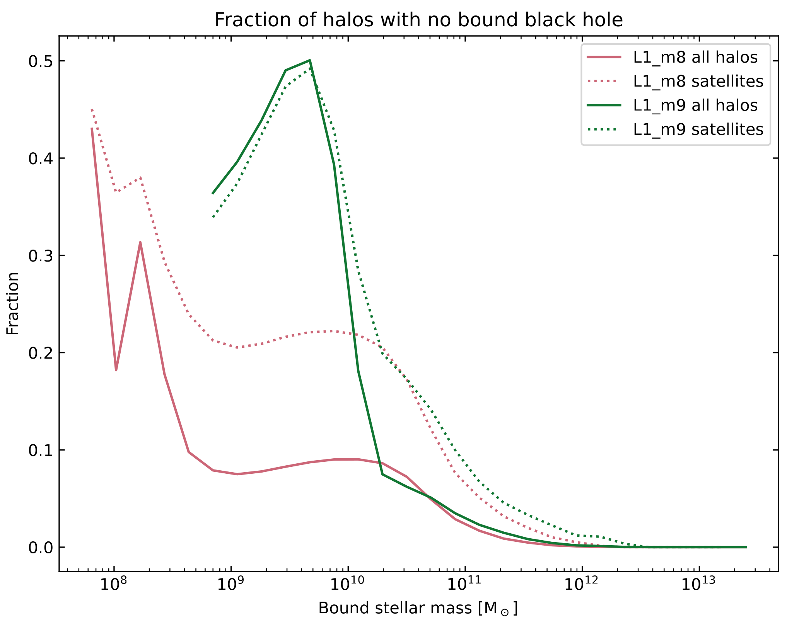
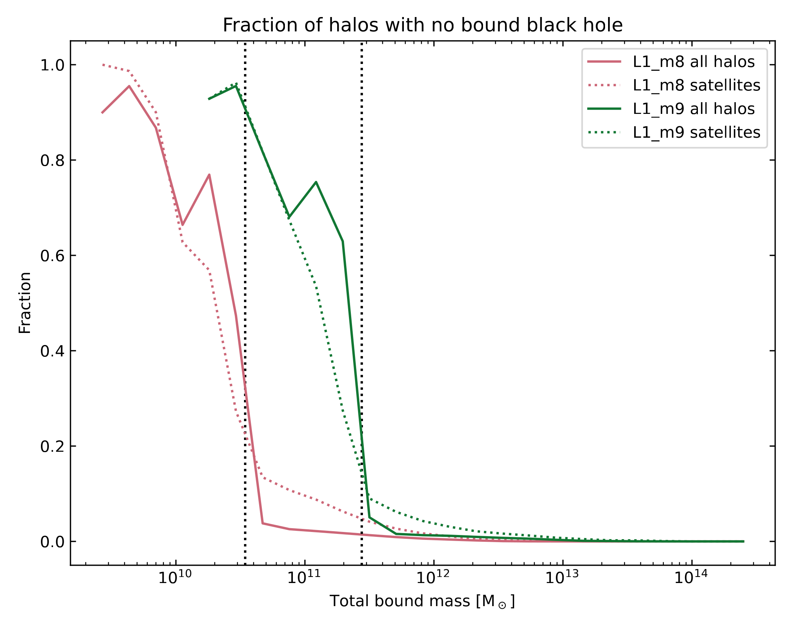

Known issues
==========================

This page tracks known technical issues related to the data products.
It will updated as new issues are discovered.
For a discussion of where the simulations diverge from observational data,
please see section 5 of the data release paper.

.. contents::
   :local:
   :backlinks: none

Simulation issues
-----------------

.. _issues_bh_satellites:

Black holes in satellite galaxies
~~~~~~~~~~~~~~~~~~~~~~~~~~~~~~~~~

For computational efficiency reasons, black hole particles are only repositioned (i.e.\ moved by hand down the potential gradient to compensate for unresolved dynamical friction) onto gas particles. For gas-poor galaxies, such as low-mass satellites, this can have the consequence that black holes leave their host galaxy, either temporarily or permanently. Care should therefore be taken when studying black holes and/or AGN feedback in satellite galaxies. See also :ref:`issues_lightcone_satellites`

.. _issues_sf_threshold:

Star formation metallicity threshold
~~~~~~~~~~~~~~~~~~~~~~~~~~~~~~~~~~~~

In all intermediate-resolution simulations except for the Jet models, particles with metallicity equal to precisely zero used a star formation threshold density of $n_\text{H} = 10~\text{cm}^{-1}$ instead of  $10^{-1}~\text{cm}^{-3}$. Tests show that this only has significant effects on galaxies with fewer than 10 star particles, where it artificially suppresses the stellar-to-halo mass ratio.

.. _issues_agn_heating:

AGN heating
~~~~~~~~~~~

AGN feedback is implemented by heating/kicking parti-
cles to very high temperatures/velocities, which is neces-
sary to overcome numerical overcooling. Because the gas particles sub-
ject to energy injection by feedback are selected from the
SPH neighbours of black holes/young stars, they tend to be
part of the dense interstellar medium. This implies that for
a few time steps following energy injection, i.e. until the
particles have responded hydrodynamically to the energy
injection, such dense and hot gas can artificially distort the
observational properties of galaxies, such as their X-ray
emission. We therefore advise to test the effect of exclud-
ing recently heated/kicked particles, which can be done
using the particle property tracking the last time a parti-
cle was injected with AGN feedback energy. For some
observables TODO: Rob, which ones? (Gas and Spec-
troscopic like temperatures, ComptonY properties, Xray
properties) the SOAP catalogs provide versions that ex-
clude particles that were subject to direct AGN heating
in the last 15 Myr and whose temperatures are between
10−1∆TAGN and 100.3∆TAGN, where ∆TAGN is the AGN
heating temperature.

Snapshots
---------

.. _issues_compression:

Overly agressive compression
~~~~~~~~~~~~~~~~~~~~~~~~~~~~

TODO: Refer to compression filters FAQ
TODO: Discuss the precision of the scale factors

.. _issues_dmantissa:

Issues reading Xray luminosities snapshot
~~~~~~~~~~~~~~~~~~~~~~~~~~~~~~~~~~~~~~~~~

TODO: What datasets were effected? What HDF5 version? Is there a better fix?

TODO: Link the effected properties in the soap docs to this page

.. _issues_total_accreted_masses:

Incorrect units for ``TotalAccretedMasses``
~~~~~~~~~~~~~~~~~~~~~~~~~~~~~~~~~~~~~~~~~~~

The field ``TotalAccretedMasses`` in the Jet & Jet_fgas-4σ runs have units of :math:`10^{10}\mathrm{M}_\odot` rather than :math:`10^{10} \mathrm{M}_\odot \mathrm{Mpc}^{-1} \mathrm{km/s}`

Halo catalogues
---------------

.. _issues_hbt_hubble:

Incorrect value of H(z) used by HBT
~~~~~~~~~~~~~~~~~~~~~~~~~~~~~~~~~~~

For a small number of snapshots HBT used the value H(z) / h instead of H(z).
This incorrect value of H0 may have a very minor effect during the unbinding step
since we add the hubble flow to particles when calculating their kinetic energy. 
The snapshots affected are 

 * Jet: snapshot 74
 * Jet_fgas-4σ: snapshot 76
 * M*−σ_fgas−4σ: snapshot 61
 * L2p8_m9: snapshots 26,46,63

.. _issues_fof_centres:

FoF centres stored with extra scale factor
~~~~~~~~~~~~~~~~~~~~~~~~~~~~~~~~~~~~~~~~~~

The values in the dataset ``soap.input_halos_fof.centres`` should be multipled by :math:`1/a`

The AGN delta T value from HYDRO_FIDUCIAL was used to calculate the recently heated gas, rather than the correct value for each simulation

Unsoftened vmax has unphysically large values. Unsoftened vmax was used when calculating BoundSubhalo/SpinParameter

Large physical apertures skipped

Intertia tensors were skipped for halos below a mass limit, rather than below a particle limit

Halo lightcones
---------------

.. _issues_lightcone_satellites:

Missing satellites galaxies
~~~~~~~~~~~~~~~~~~~~~~~~~~~

Connected to . Because the locations of black hole particles are used to place galaxies on the lightcone, a small fraction of satellite galaxies is missing from the galaxy lightcones. \todo{John, are they all missing or did we do something about it??? JCH: We haven't done anything about it. We could compute what fraction of satellites have no black hole from the SOAP outputs to get some idea of how bad it is.}
Figure~\ref{fig:bh_fraction} shows the fraction of halos at redshift $z=0$ which are affected, as a function of bound stellar mass.

HEALpix maps
------------

.. _issues_dispersion_measure:

Disperson measure correction
~~~~~~~~~~~~~~~~~~~~~~~~~~~~

TODO: Is this also for doppler B? New bug?
The original HEALPix maps for the kinetic SZ effect
and the dispersion measure were computed using a wrong
power of the cosmological scale factor. This was cor-
rected using the expansion factor of the midpoint of each
lightcone shell, which has a width of ∆z = 0.05. Note
that for those simulations and redshifts for which particle
lightcone data is available, the maps can be recomputed if
desired

TODO: Ask for comments
TODO: Is this a new bug?
Unweighted neutrino masses used in maps, so maps are noisier than they could have been

TODO: This is a new bug
Search radius for smoothing particles when adding values to the map was approx a factor of 1.9 too small. Some particles which should have been smoothed where instead only included into a singular pixel
Negligible
See appendix A of Will's paper, and 
All maps except xray, also xray maps above z=0.5 for L1 runs, xray maps for all cosmology runs

Very bright pixels in the X-ray photon count rate maps. Some of the maps, such as those for the PLANCK and L2800N5040 fiducial models have an extremley X-ray bright pixel that cannot be reproduced from the particle data. These pixels are 1-2 orders of magnitude brighter than all other pixels in the lightcone, and should be smoothed over (by neighbouring pixels, healpix function).
Cause unknown

TODO: New bug
TODO: Do some maps still have incorrect UVB?
Xray maps above 0.5 for L1, all cosmology variations

Particle lightcones
-------------------

TODO: Ask John
Black hole particles crossing the lightcone multiple times due to being repositioned into and out-of the lightcone
Same black hole can appear in quick succession
Particles will repeat, but should not do so close together
All runs

Compression on LastAGNFeedbackScaleFactors means it is not possible to recover if a particle has been heated by AGN within the last 15 Myrs. 
BFloat16 instead 
Use density temperature cut

